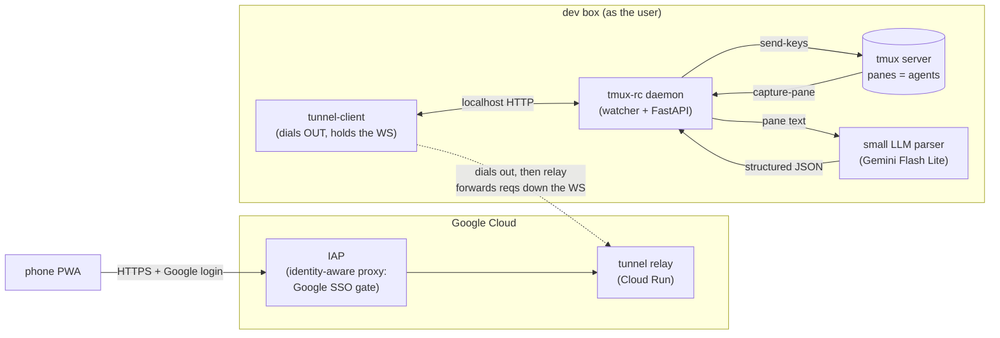
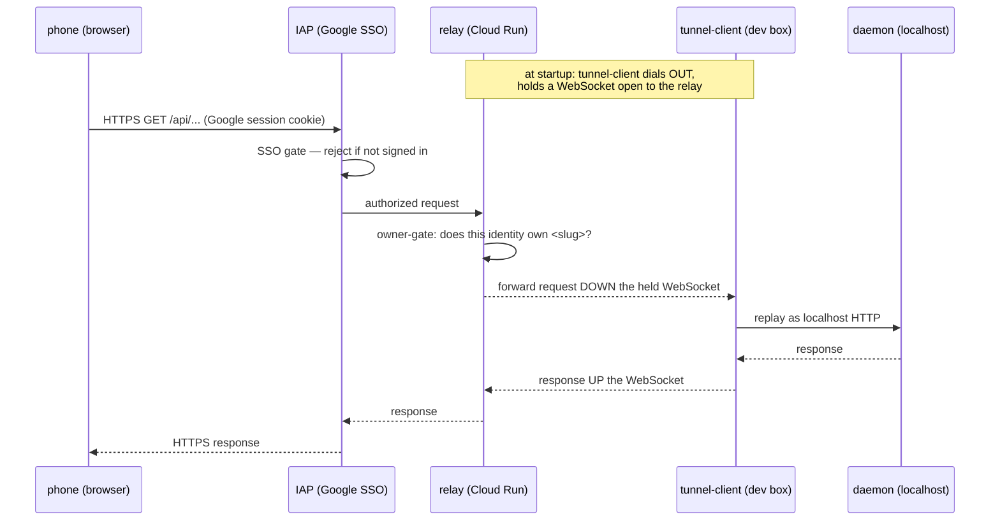
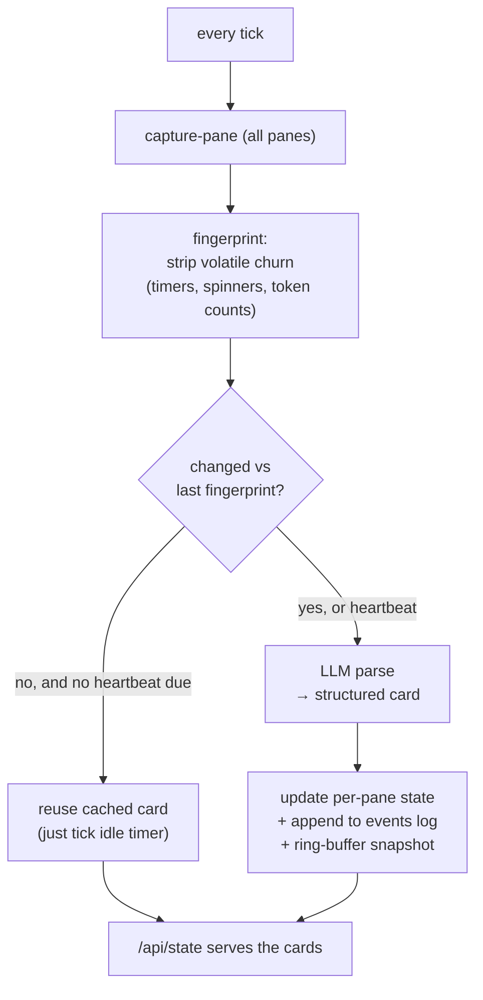
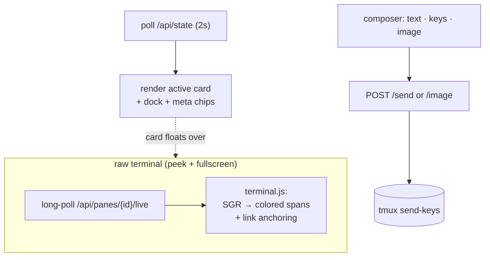
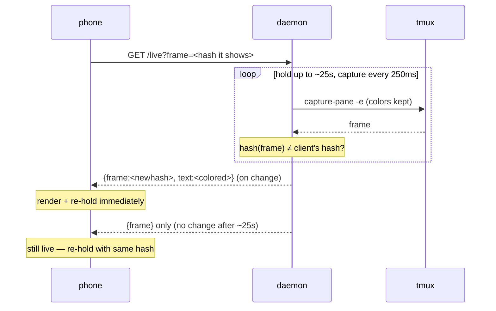
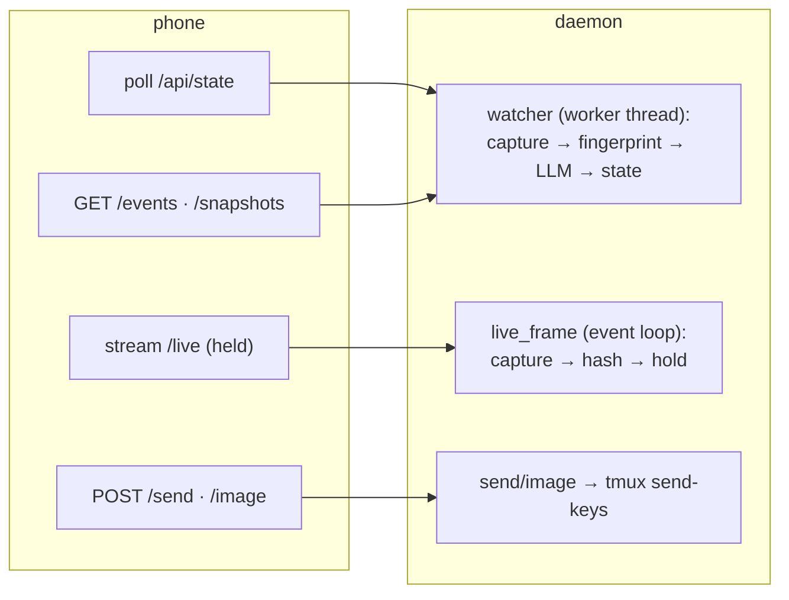

# How the whole system works

Status: **implemented** — an end-to-end tour of tmux-rc as it actually runs today,
from a tmux pane on a dev box to a live, colored terminal on a phone. Start here; the
other design notes go deep on individual pieces.

## The one idea

**Observe the terminal, not the agent.** tmux-rc never integrates with Claude Code,
Codex, Gemini, or any specific tool. It watches what a tmux pane *renders* — the same
pixels a human sees — and sends keystrokes back, exactly as a human would. Everything
below follows from that: the daemon is an observer with a keyboard, tmux is the system
of record, and the phone is a dumb remote. No tool ever knows tmux-rc exists.

**Why the traffic flows this way.** The daemon has **no inbound port** — nothing to
port-forward, nothing exposed. Instead the `tunnel-client` process (running on the dev
box, as the user) dials *outbound* to the Cloud Run relay and holds a WebSocket open.
The phone hits `https://<slug>.<tunnel-domain>`; **IAP** (Google's identity-aware proxy) gates
that with Google SSO *before* any request reaches the relay, and an owner-gate check
confirms the logged-in identity owns the slug. Authorized requests are then serialized
and forwarded *down* the held WebSocket to the tunnel-client, which replays them against
the daemon on `localhost` and pipes responses back up. So: two auth layers (IAP SSO +
owner-gate) in front, no open port behind, and the daemon still holds no privileged
position — it runs *as the user*, drives the user's own tmux socket, and a human can
stay attached to the same session at the same time.

## The pieces

- **tmux** — the system of record. Every pane is a running program (an AI agent, a
  shell). tmux-rc reads panes with `capture-pane` (non-disruptive, works from an
  unrelated process) and injects input with `send-keys`. Nothing here holds a pty.
- **The watcher** — a background poll loop in the daemon. Each tick it captures the
  target panes, decides whether anything meaningful changed, and (when it did) asks the
  LLM to turn the raw screen into a structured card. See [the observation loop](#the-observation-loop).
- **The parser LLM** — a small, cheap model given a context-cached prompt. It reads a
  screen of terminal text and returns JSON: a headline, an activity state
  (running / waiting / idle), a pending question with its options, a task list, links,
  status entries. It is vendor-agnostic by construction — it identifies the tool from
  on-screen chrome, not an API.
- **The FastAPI server** — serves the PWA and a small JSON API (`/api/state`, per-pane
  endpoints for events, snapshots, live frames, and input). Runs on the event loop;
  the watcher runs its blocking work in a worker thread.
- **The PWA** — a no-framework, no-build vanilla-JS single page. Renders one pane's card
  at a time with a dock of the others; the raw terminal streams live behind the card.
- **The tunnel** — the daemon has no inbound port. A tunnel-client process dials *out* to
  a Cloud Run relay over a WebSocket; the relay forwards phone HTTP requests down that
  socket and pipes responses back. The phone reaches `https://<slug>.<tunnel-domain>`; IAP +
  an owner-gate authorize it. Detailed below.

## Worked example: how a phone request reaches localhost

> **This section describes one deployment, not a requirement.** The daemon speaks plain
> HTTP on loopback and does not know or care how you reach it. What follows is the
> authors' own setup — a private relay fronted by Google IAP — written out end to end
> because a concrete chain explains the *shape* of the problem better than an abstract
> one: outbound-only connection, authentication strictly in front of the daemon, and a
> pipe that carries whole request/response pairs.
>
> You are not expected to reproduce it. Tailscale, a Cloudflare Tunnel with Access, and
> any other authenticating front end all fill the same role — see
> [Reaching the daemon from outside localhost](../../deploy/). Read the properties in
> "Consequences worth internalizing" below as the bar any alternative should clear.

No inbound port on the dev box, and two auth layers in front. A single phone request
makes this hop chain:

Consequences worth internalizing — these are the properties to look for in *whatever*
front end you choose, not artifacts of this particular one:

- **The connection is outbound-only.** Nothing listens for the internet on the dev box;
  the tunnel-client initiates and keeps the socket. A reboot or network blip just means
  it re-dials (with backoff) — the relay is stateless about any one client.
- **Two gates, both before the daemon.** IAP's Google SSO stops anonymous traffic at the
  edge; the relay's owner-gate binds the authenticated identity to the specific tunnel
  slug. The daemon itself trusts that whatever arrives over its localhost socket is
  already authorized (loopback-only claims, same trust model as its audit log).
- **The relay is a dumb pipe.** It serializes whole HTTP request/response pairs over the
  WebSocket — it does not stream, which is exactly why [live mode](#live-mode) uses
  long-poll rather than a phone-originated stream.
- **Nothing here is load-bearing for the daemon.** It has no notion of relays, slugs, or
  identity headers beyond one loopback-only trust claim for the audit log. Swap this
  whole chain for a Tailscale address and the daemon behaves identically.

## The observation loop

The watcher is the heart. It is deliberately *not* real-time — its cadence exists to
feed the LLM economically, not to drive the eyes (that's live mode's job, below).

Two subtleties that everything downstream depends on:

- **The fingerprint.** A working agent repaints constantly — a spinner, a ticking
  `2m 3s`, a climbing token counter — without the *content* changing. The watcher strips
  those volatile bits before asking "is this a new screen?", so the LLM fires on real
  changes, not animation. (The same volatile set is deliberately *not* stripped in live
  mode — there, you want the spinner to spin.)
- **tmux is the state; caches are bounded observations.** The events log and the snapshot
  ring buffer live in memory and are lost on daemon restart — that's correct. Their
  recovery path is re-observation, not a saved file. This is the load-bearing rule of the
  whole project (see [the activity-log design](activity-log.md) for why it justifies caching
  at all: TUIs redraw in place, so scrollback is *not* a faithful record of what was
  observed).

## What the phone shows

One pane is the **active card**: headline, activity badge, the pending question rendered
as tappable buttons, a task list, links, a feed of recent events. The other panes are a
**dock** of icons across the top; the selected icon joins visually to the card like a
browser tab. Behind and below the card, the pane's **raw terminal** shows through —
and that raw view is *live*.

Input is a single persistent bar targeting the active pane: type text, tap special keys
(Enter, Esc, Ctrl-C…), or attach an image. Attaching an image **stages it in the
composer** (a thumbnail chip) without touching the pane — nothing is sent until you
press Send/Enter, which flushes text and image to the pane together (text, then image,
then one Enter). This mirrors a phone's "caption then send the photo" feel and treats a
staged image as un-sent draft state the auto-update reload won't eat. On send, the
image is staged to disk on the daemon and delivered by clipboard-paste when the desktop
session is unlocked, or by typing the file path when it's locked or headless — a small
**presence-aware** decision, since a locked GNOME session blocks clipboard reads (see
[deployment](deployment.md)).

## Live mode

When a raw pane is on screen, it behaves like a terminal you're watching, not a
screenshot you re-request — in full color, within a few hundred milliseconds of any
change. This runs on its own path, decoupled from the watcher's cadence and never
touching the LLM. (Its own design note lands with the live-view feature; the shape
below is the whole of it.)

The design choices, each covered in the live-view design note (ships with the feature):

- **Long-poll, not WebSocket** — the tunnel serializes whole HTTP request/response pairs
  and can't stream a phone-originated socket today; long-poll gives streaming *feel* over
  the transport that exists. A held request returns the instant the screen's content hash
  differs from what the phone is showing, or a tiny "no change" reply after ~25s.
- **Full colored frames, not deltas** — a resize or reflow changes every line, so deltas
  would degenerate to full frames exactly when the screen is most confusing. Frames are
  ~13KB raw but gzip to ~2.8KB.
- **Color = live, gray = stale** — a colored frame is fresh; if the *connection* goes
  unhealthy the surface desaturates (a CSS filter, links intact) and re-colors on the
  next response. Staleness is about the connection, not screen activity — an idle pane
  produces no frames for long stretches yet is perfectly live.
- **The frame hash is an ETag**, not a diff anchor: it's how the server knows the phone
  is current without keeping per-client state, and it's the "no change" reply.
- **Rendering is hand-rolled, not xterm.js** — the client's `terminal.js` turns the
  frame's SGR runs into colored spans itself (~170 lines). We render an *already-composed*
  frame, so we need SGR→span, not a pty emulator; a vendored emulator (xterm.js) would be
  ~100KB+ and a build-step dependency to use ~5% of. The switch triggers — true
  interactivity, a raw stream, or fidelity bugs beyond the common SGR subset — are weighed
  in the live-view design note.

## Request paths at a glance

`/api/state` and the events/snapshot reads are served from what the watcher already
computed. `/live` is its own tight capture loop — no LLM, its own cadence. `/send` and
`/image` turn straight into `send-keys`. The split keeps a heavy LLM parse or a big
image upload off the event loop (they run in worker threads) so live streaming and
polling stay responsive.

## Where to go deeper

- [Design notes index](../) — every subsystem's *why*.
- [The activity log](activity-log.md) — how the event feed survives a reload, and the
  tmux-is-state rule.
- The live view — full streaming design and rejected alternatives (note lands with the feature).
- [Deployment](deployment.md) — running as a user systemd unit, the tunnel, presence.
- [Cloud architecture](cloud-architecture.md) — the hosted/multi-tenant future.
