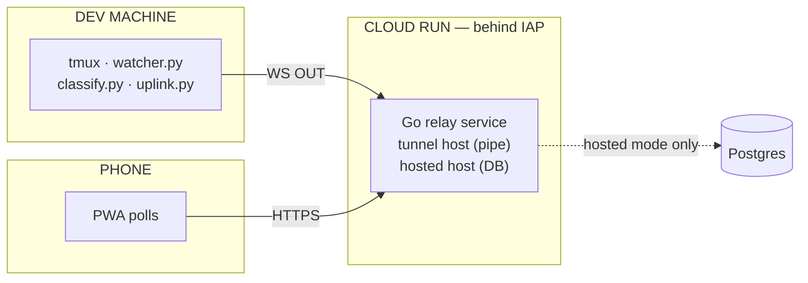

# Cloud Architecture — tmux-rc Remote Access

## Problem

tmux-rc runs on the dev machine next to tmux and serves its PWA over LAN.
To use it from anywhere (coffee shop, phone on cellular, etc.) it needs to be
reachable over the internet — but not by just anyone.

## Two Modes

### Tunnel (`*.<tunnel-domain>`) — open source

A stateless relay on Cloud Run behind IAP. The local tmux-rc process
connects OUT to the relay via WebSocket; the phone connects IN via HTTPS.
The relay holds one buffer per user (the latest state) and pipes commands
back. No persistence, no database. If the agent disconnects, the phone sees
"stale" until it reconnects.

This is the open-source offering: anyone can deploy a tunnel relay (on Cloud
Run, fly.io, or any WS-capable host) and point their local agent at it.

### Hosted (`*.<hosted-domain>`) — commercial

State is persisted in Postgres. The phone can browse historical timelines,
view past sessions, query cost/usage via QueryStory. The agent pushes state
the same way (WebSocket), but the relay writes it to the DB instead of
(only) buffering it in memory.

This is the paid/gated offering. Same protocol, richer features.

## Architecture



**Single Go Cloud Run service** handles both modes. Mode is selected by the
Host header — the same binary, same deploy, same IAP client.

## Key Design Decisions

**Agent connects OUT via WebSocket.** No port forwarding needed on the dev
machine. The agent initiates a WebSocket to `wss://<slug>.<tunnel-domain>/_ws/agent`.
Cloud Run supports WS with a 3600s timeout.

**OAuth2 access token for agent auth.** The agent already has ADC credentials
for Gemini. The same token authenticates the WS upgrade request. The relay
validates it against Google's tokeninfo endpoint and confirms the email matches
the subdomain slug. No new secrets to manage.

**IAP for phone auth.** Zero custom auth code. The phone user authenticates
via Google SSO through IAP. The relay reads `X-Goog-Authenticated-User-Email`
from the header (set by IAP, trusted because ingress=INTERNAL_LOAD_BALANCER
blocks direct access).

**Classification stays local.** The LLM calls (Gemini Flash Lite) stay on the
dev machine. Avoids shipping raw captures over the wire, keeps latency low, and
authenticates to Vertex with a local long-lived service-account key (no
server-side credential management; see
[durable-vertex-auth.md](durable-vertex-auth.md)).

**Full-state push, not deltas.** The state blob is small (~few KB for all
panes). Full push means the relay always has a consistent picture. No
ordering, missed-message, or reconciliation bugs.

**Phone keeps polling.** The PWA already polls GET /api/state every 2s. Adding
a phone-side WebSocket would require SW changes, reconnection logic, and
offline handling — complexity for minimal benefit on a glance-and-unblock tool.

**min_instance_count = 1.** WS connections are persistent. Scale-to-zero would
drop all agents. One warm instance is ~$5-10/mo.

## Protocol (Agent ↔ Cloud)

JSON-over-WebSocket. The agent authenticates on the upgrade request with a
Bearer token.

### Agent → Cloud (upstream)

```json
{"type": "hello", "version": 1, "user": "you@example.com"}
{"type": "state", "panes": [...], "stale": false, "usage": {...}}
{"type": "snapshot", "pane_id": "%3", "snap_id": "...", "text": "..."}
{"type": "command_result", "req_id": "abc123", "ok": true}
```

### Cloud → Agent (downstream)

```json
{"type": "welcome", "mode": "tunnel"|"hosted"}
{"type": "command", "req_id": "...", "action": "send_keys", "pane_id": "%3", "keys": "yes", "enter": true, "literal": true}
{"type": "command", "req_id": "...", "action": "select_pane", "pane_id": "%3"}
{"type": "command", "req_id": "...", "action": "send_image", "pane_id": "%3", "data_b64": "...", "mime": "image/png"}
```

## Per-User Isolation

- `<slug>.<tunnel-domain>` → only that user's agent can register there (OAuth email
  must match slug), only that user's phone can poll there (IAP email verified)
- IAP provides the outer auth boundary (your org's domain only)
- Subdomain slug + email matching provides inner per-user isolation
- One active agent per slug (last-connect wins; multi-machine: use
  `<slug>-dev1.<tunnel-domain>` if needed later)

## Infrastructure

The relay needs, in whatever form your cloud provides it:

- **DNS** — a wildcard record per mode (`*.<tunnel-domain>`, `*.<hosted-domain>`)
  pointing at the load balancer, plus the DNS-01 records its certs authorize against.
- **Certificates** — a wildcard cert per subdomain, wired into the LB's cert map.
- **Backend** — the Cloud Run service with `ingress=INTERNAL_LOAD_BALANCER` (so no request
  from the public internet reaches it except through the IAP-gated load balancer; qualifying
  internal traffic can still invoke it, so keep `run.invoker` least-privilege too),
  `timeout=3600s` (WS lifetime), `min=1` (see above), its own service account, and a
  serverless NEG fronted by a backend service with IAP enabled.
- **URL map** — a host rule routing both wildcard hosts to the relay's path matcher.
- **Access** — grant IAP access to the group that should reach it, and
  `roles/run.invoker` to the IAP service agent.

## Open Source vs Commercial Boundary

**Open source** (tmux-rc repo):
- All Python code including the new uplink.py
- The PWA
- Protocol spec
- Reference tunnel relay (standalone Go binary, or simplified Python relay)

**Commercial** (private repos):
- Hosted mode (Postgres persistence)
- Timeline/history/analytics endpoints
- QueryStory integration
- The deployed infrastructure

## Postgres Schema (Hosted Mode)

| Table | Purpose | Retention |
|-------|---------|-----------|
| users | email → slug (from IAP identity) | forever |
| agents | per-machine connection tracking | forever |
| pane_states | full state JSON per tick | 30d, downsample after |
| events | activity feed entries | indefinite (small) |
| snapshots | raw capture-pane text | 7d (large) |
| summaries | idle burst summaries | indefinite |
| llm_calls | token/cost per LLM call | indefinite |

Exposed as a QueryStory data source for self-introspection.

## Connectivity and Resilience

- Agent reconnects with exponential backoff (1s → 60s cap)
- During disconnection, local-only mode still works (watcher keeps running)
- On reconnect, agent sends fresh full state immediately
- Cloud marks connection stale after 10s without heartbeat
- Cloud Run instance cycling causes brief (~5s) stale period; agent auto-reconnects

## Phased Implementation

1. **Python uplink client** (1-2 days) — `uplink.py`, opt-in via env var
2. **Go tunnel relay** (2-3 days) — in a private repo, test locally
3. **Infrastructure deploy** (1-2 days) — Terraform, wait for certs
4. **Hosted mode + Postgres** (3-5 days) — persistence, timeline API, QueryStory
5. **Open-source packaging** (2-3 days) — standalone relay binary, README

## Alternatives Considered

**gRPC instead of WebSocket.** Would work but adds protobuf compilation and
code generation. The protocol is trivially JSON messages — gRPC's typing
benefits don't justify the toolchain cost here.

**Cloudflare Tunnel instead of Cloud Run.** We already run a couple of Cloudflare
tunnels elsewhere. These work for point-to-point but don't give us
the relay semantics (phone → cloud → agent). A cf tunnel would still need a
relay process somewhere.

**Phone-side WebSocket (push instead of poll).** Appealing for latency but
the PWA already works well with 2s polling. WS on the phone means managing
reconnection, service worker wake, and offline state — all for saving ~1s of
latency on a tool used for quick glances.

**Classification in the cloud.** Would centralize Gemini usage and simplify
the agent. But it means shipping 200-line raw captures every 1.5s over the
wire, managing Gemini credentials server-side, and adding latency to the
classification path. Keeping it local is simpler and faster.
