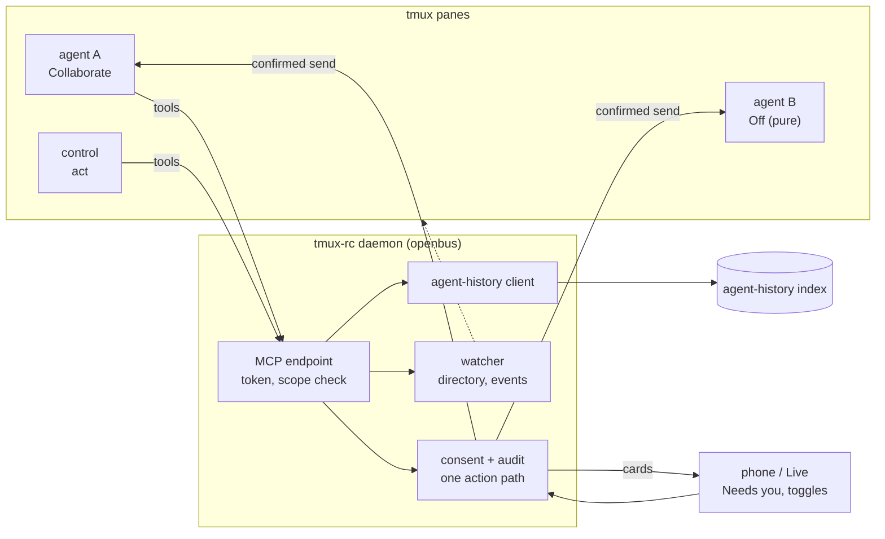

# Design: agent history, introspection and opt-in cross-agent connect

Status: **proposed** — no code yet. Maps what exists for indexing past agent sessions
and reading the fleet, decides who besides the human may query it, and designs the
opt-in that lets an agent see and message its siblings.

The short version: the daemon serves one MCP endpoint over the bus verbs that
[the agent client](agent-client.md) and [the control session](control-session-routing.md)
already call for. No agent sees it by default. A per-agent **Connect** toggle grants it
with explicit scopes, injected when the agent is launched or resumed and revoked at the
daemon instantly. Every call takes the same consent and audit path as a tap on the
phone.

## How it fits together

Most of this ground is already covered. Each document below owns one piece. The
mapping onto the three openbus contracts proposed in the hosting plan
(querystory/planning#488: event envelope, harness-neutral action vocabulary, agent
manifest) follows the list.

- [openbus narrative](openbus-narrative.md): the hub. It names the build items this doc
  serves: addressing and messaging (1), consent on the peer channel (2), memory on the
  bus (3).
- [agentic control plane](agentic-control-plane.md): intent, confirm, execute, with
  confirmation tiered by risk. Its "no code yet" status is stale: Live's text mode now
  implements the one-tap tier as consent cards.
- [the agent client](agent-client.md): an agent as the third client on the bus, the
  silent failures of `send-keys` orchestration, and the three verbs (read state,
  confirmed send, subscribe). It already chose MCP over the daemon and rejected
  harness-specific integrations. This doc does not reopen either.
- [control session and routing](control-session-routing.md): the `control` pane, the
  fleet directory, and workstream identity. Control is the first agent that would hold
  Connect, with the widest scope.
- [orchestrating agents from an agent](../agent-orchestration.md): the how-to for raw
  `send-keys`, which is what agents do today with no bus.
- [configuring your agents](../agent-setup.md): self-published titles and on-screen
  session ids, which make a pane addressable and bindable to its transcript.
- [agent-history README](https://github.com/querystory/tmux-rc/blob/main/agent-history/README.md):
  the session index, its format contract, and "memory is pulled, never pushed."
- [Codex native context](codex-native-context.md): native protocols as evidence, never
  authority, and the pane-to-thread binding.
- [PR/session associations](pr-session-associations.md) and its
  [lifecycle follow-up](pr-association-lifecycle.md): which live pane holds a PR's
  context.
- [persistent pane history](pane-history.md) and
  [saved conversations](live-conversation-history.md): the daemon's own structural
  record and the proposed Live and pane-input store. Neither is the transcript index.
- [Live Mode](live-mode.md): voice and text front end, pane tools, consent cards, and
  the single audited tool-call path.
- [PRD](../PRD.md): the founding rule. Watch what a pane renders, and integrate with no
  agent in particular.

In #488's terms, a history lookup or a message is an action with an actor, and a
delivered message is also an observed event on the recipient's screen. Messaging is the
vocabulary's "send a message", with a new actor kind (an agent session rather than a
person) on the one audited path. Connect is a field of the manifest's tool surface. No
fourth contract is needed.

## Agent history and introspection today

Two stores answer "what has this agent done", and they are easy to confuse.

**The daemon's view** is live and screen-derived. For each pane it holds the classified
state, an idle summary per burst, the event log, tracked PRs and structural history. It
serves current state and recent events through `/api/state`, `/api/digest`
(documented as "the endpoint for agents/scripts") and per-pane events. Structural
history comes from `/api/history`. It knows only what the screen showed while the
daemon was watching.

**agent-history** is the Go CLI in `agent-history/`. It indexes harness transcripts
into small greppable files: one entry per session, holding cwd, branches, PR links,
title, the prompts that started or steered it (the human's messages; for a headless run
or a subagent, the task its caller sent) and the exact resume command.
- **Harnesses.** On `main` it reads Claude Code, pushed by its Stop, SessionEnd and
  SubagentStop hooks, and Codex, pulled by reconcile.
- **omp is in review** (#307, and the larger #293). The #488 plan lists omp as already
  indexed, which is true only once one of them lands.
- **Running sessions.** It says which sessions are running now and in which pane. Claude
  has a process registry. Codex is detected from open rollout files, plus the session id
  shown in its status bar.
- **Coverage.** It is built from transcripts, so it also covers sessions no watched pane
  ever showed: subagents, headless runs, anything from before a reboot.

The daemon uses it in one place. Live Mode's `find_sessions` and `resume_session`
(`openbus/agent_history.py`) find past work by topic and reopen it in its original
directory. Resuming changes a pane, so in a text session it waits for a consent card.
Finding only reads, so it runs at once. Both are recorded by the same audit point
(`_handle_tool_call`).

### What it is for

- **Resume after a crash or reboot.** The 47 panes lost to a stray `kill-server` on
  2026-09-30 were rebuilt from transcripts. Each index entry carries its resume argv and
  cwd, and #488's WS-D turns that into one "restore N sessions?" item.
- **Find the session behind a PR.** The index records PR links per session. The watcher
  tracks PR associations for live panes. Together they answer "who was on #4955",
  whether or not the pane still exists.
- **"What is X doing" from Live or Chat.** The digest gives the live answer, and the
  index gives the historical one. Today only Live joins the two.
- **Handoff and routing.** Find the session with the context, then resume it or address
  its live pane. `resolve` ranks candidates in milliseconds with no model call, which is
  what control's fast path needs.
- **Cost and telemetry** are *not* served by the index. Cost lives in harness OTEL and
  the daemon's records (#488 WS-G). The index only supplies the session id that joins
  them.

### Its limits

- **Routing, not memory.** The index keeps about 1% of transcript bytes: the prompts
  (what the human typed, or a headless or subagent task, which a model may have written),
  plus the session's identity. "What did the agent conclude" still needs the
  transcript. The narrative's memory item (retrieval over transcripts) is unbuilt.
  agent-history is its provenance half, not its retrieval half.
- **Lexical only.** It misses paraphrases by design, until real misses justify aliases
  or embeddings.
- **Staleness.** Claude entries arrive within seconds. Codex and omp wait for a
  reconcile that a search starts but does not wait for.
- **One home directory.** A hosted box gets its own index. No fleet-wide index is
  proposed.
- **Best-effort liveness.** When it cannot tell whether a session is running, it says
  `running_unknown` rather than guess.

## Who should be able to query it, and how

Today only the human can, through the phone and Live. Agents have concrete reasons to
ask:
- an orchestrator needs the directory;
- a stuck agent wants to know what a sibling found;
- a new session wants the last session's decisions on this branch.

Four ways to let them:

**(a) Human only.** This is today. It is safe and pure. The cost is the one the agent
client measured: every cross-agent need goes through a person, or degrades to
`send-keys` and `capture-pane`, which fail silently.

**(b) A skill wrapping the CLI.** One skill file teaching `agent-history resolve` and
`get`. Claude Code, Codex and omp all read that format, so it is nearly free and needs
no daemon. But it has three problems:
- It installs per user or per repo, not per pane, so installing it makes every agent
  aware.
- It carries no identity.
- Anything beyond reading the index becomes "curl the daemon", unauthenticated and
  outside the audit record.

**(c) A daemon-served MCP endpoint.** The bus verbs plus history become tools in the
harness's own list. The agent client's evidence decides this: the orchestrator *could*
have curled `/api/digest` and never did, and a tool in the list gets used. Claude Code,
Codex, OpenCode and omp all load MCP servers. Because the daemon owns the endpoint,
every call gets an authenticated caller, a scope check, an audit record and, where the
tier asks for one, a consent card. The history tools wrap the `agent_history` client
Live already uses.

**(d) Hooks.** Claude Code hooks fire on lifecycle events, and a Stop hook can even hand
the agent text and keep it going. Codex has hooks and a turn-complete notify program.
Hooks are the right *event* source: #488's D11 and WS-E, and agent-history's own
indexer. They are the wrong query or message surface, for three reasons:
- They are configured per harness.
- They push, against "memory is pulled, never pushed".
- An injected message carries no confirmation tier and leaves no trace on screen.

**Decision: (c).** Ship (b) as a documented, zero-infrastructure fallback for history
search only. Hooks stay an evidence source.

| | Skill (b) | Daemon MCP (c) | Hooks (d) |
|---|---|---|---|
| Portability | One file, several harnesses | Every harness here | Per-harness config |
| Per-agent opt-in | No (per user or repo) | Yes (per launch) | Awkward |
| Caller identity, scope | None | Per-agent token and scopes | Harness-local |
| Audit | Outside the daemon | The one audited path | Outside the daemon |
| Injection blast radius | Whatever the shell reaches | Bounded by scope | Text injected into the turn |
| Token cost | CLI output | Bounded results | Every turn it fires |
| Staleness | Index only | Index plus live state | Event-time only |

**Reading another agent's work is untrusted input**, whichever option ships. A
transcript excerpt, a pane summary or a capture is text another model wrote, or a person
pasted, and it can carry instructions. The endpoint applies three rules:
- **Results are data.** They come back marked as data with their source named. The tool
  descriptions repeat control's charter: evidence for routing, never authority.
- **History is index fields only.** History tools return title, cwd, branches, PRs and
  timestamps, never raw tool output, which is most of the injection surface. `get`
  and `resolve` expose only that metadata today. Returning prompts or excerpts needs a
  new bounded contract in the CLI (which prompts, how truncated), and even then a
  subagent's task is model-written and just as untrusted.
- **Reads are scoped.** A read covers what the human can see, not every transcript on
  disk.

## Cross-agent messaging

A message is a **send through the daemon's one keystroke path**, never an agent typing
into another pane with tmux. That path already resolves the pane's canonical id,
audits the send with its actor, and schedules a re-parse. The peer verb adds two things:
- **An incarnation check.** The HTTP send does not check one today. Live's dispatch
  does, by passing the expected pid. The peer verb requires the incarnation the
  directory issued, so a recycled `%N` is refused.
- **Confirmation.** The agent client's confirmed send answers after the re-parse, so
  "sent" means it landed.

**Addressing.** A target is a pane id with the incarnation token the directory issued,
or a workstream handle (a PR, a title, the `control` role) that resolves to exactly one
live pane. Ambiguity is refused, never guessed. Window indices are never addresses.

**What the recipient sees.** The message arrives as a prompt in its input, prefixed by
one provenance line naming the sender. A person reading the pane can tell a machine sent
it, which is the narrative's "announce that a machine typed it". The recipient needs no
tools to receive, so any harness works. Replies come back the same way, or as the agent
client's v0 reply path: a status line on the recipient's own screen that a subscribed
sender sees through the directory.

**Delivery.** At most once, confirmed, and only when the recipient is waiting for input.
Typing into a running turn steers it, and typing into a menu answers it, and neither is
what the sender asked. A message for a busy pane waits in a small in-memory queue in the
daemon, and goes in at the next idle transition. Just before typing, under the pane's
send lock, the daemon checks three things again: the incarnation, that the screen is
still the idle one it saw, and that a workstream handle still resolves to this pane. This
is the same guard push answers use. If any of them changed, the message waits for the
next idle transition rather than steering a turn or landing in someone's draft. The sender always gets one result:
delivered, refused or expired, or queued as an interim answer. A queued message keeps
its id, and the sender can ask for its final outcome or subscribe to it. Nothing fails
silently, which is the agent client's founding complaint. At most once needs identity:
the caller supplies a message id, and the daemon refuses a retried id instead of typing
it twice. The ids and the queue live in memory, and ids are kept for a bounded window
(an hour, capped in count), so the guarantee holds within that window of one daemon
lifetime. A retry across a daemon restart can type a message twice. That is accepted
for v1, because a restart already drops the queue and a duplicate prompt is visible.

**Consent.** These are the control-plane tiers, with an agent as the actor:
- **Reads run at once and are audited.** That covers the directory, pane detail and
  history.
- **A plain-text message to an idle agent pane is a one-tap card in Needs you.** It
  is modelled on Live text mode's propose and decide cards. Live keeps its pending
  approval on one voice session's socket, so peer requests need their own record in the
  daemon: a pending-consent item with an expiry, cancelled by revocation, shown in Needs
  you and answered through an ordinary phone endpoint. The human can approve that one message, or approve the pair
  for the rest of the recipient's life, so one orchestrator driving three siblings does
  not cost a tap per instruction.
- **Some actions are never offered to peers.** Key presses, windows, resumes, and sends
  to shell panes (where text runs as a command) stay inside control's scope and tiers.
- **Both ends opt in.** Only an agent granted *reachable* receives peer messages. A pure
  agent hears from the human and from control, and no one else.

**Loops and runaways.** Two agents that perceive and type at each other can ping-pong.
- **Hop limit.** The daemon, not the caller, assigns each message's conversation and
  hop count: a message from an agent that received one in the last few minutes counts as
  a reply to it, so starting a "new" conversation cannot reset the count. Past a small
  limit, the next hop needs a card even for an approved pair.
- **Rate and size limits.** Limits per sender and per pair stop a confused agent
  flooding a sibling. A byte cap per message and a total queued-byte budget are enforced
  before anything is stored, so one call cannot fill the queue, a card or a recipient's
  context.
- **Idle-only delivery.** Every exchange happens as a whole, visible turn on screen.
- **Backstop.** Revoking Connect stops a loop on its next call.

**No `ask_human` tool.** An agent that needs a person asks on its own screen. That
already becomes a tappable Needs-you item for every harness, and a second channel would
duplicate it.

## The Connect toggle

### Default: pure, and what that does not mean

No agent gets the endpoint unless a person grants it. A pure agent has no openbus tools,
no instructions about siblings, and receives nothing except from the human or control.
This is the default everywhere, self-hosted and hosted.

"Pure" is a property of **what is offered**, not an isolation boundary. Any process
running as the user can still run `tmux send-keys`, curl the daemon on localhost, or
read another pane's environment. Panes are not sandboxes. The sandbox changes this only
partly. Codex's workspace sandbox turns network off by default, which closes the
daemon's HTTP port. The qs-app investigation #488 cites (#4811) found that MCP calls
bypass that sandbox. So for a sandboxed agent the grant really does gate everything that
needs the daemon. Whether a sandbox also closes the tmux socket varies by harness and
settings, so check it per harness before calling it a boundary. For an unsandboxed agent
the grant makes cooperation reliable and attributable, not possible.

There is a related gap to fix in the first PR. The daemon honors the `X-Tunnel-User`
identity header from any loopback peer, because the tunnel client connects from
localhost. A local agent is also a loopback peer. It could send with that header and be
audited as the owner. A shared secret would stop accidental spoofing only: the tunnel
client runs as the same user, so an unsandboxed agent could read the secret. Closing it
for real means the tunnel credential lives where agents cannot read it, such as a
separate system user for the tunnel client, or a hosted box where agents run as a
different user from the daemon.

### Scopes

- **read**: the fleet directory and pane detail, limited to the panes the human sees.
- **history**: search and get, limited to the grantee's repo unless widened.
- **message**: send to reachable peers, under the tiers above.
- **reachable**: may receive peer messages.
- **act**: keys, windows, resume and handoff. This is control's charter only.

The UI offers **Off**, **Observe** (read and history) and **Collaborate** (adds message
and reachable). Single scopes are an advanced setting.

### Where the grant lives and how it takes effect

Identity is the agent session, not the pane: pane ids recycle, and session ids survive
resume. A grant is therefore stored against the harness session id. For a manifest agent
it is a tool-surface field in C4. For an ad-hoc pane it goes in a small daemon table
keyed the same way. A brand-new agent has no session id until it starts, so its
launch token is first bound to the new pane and process. It is rebound to the session id
once that is known. Claude Code accepts a preset session id; Codex and omp report theirs
after launch through agent-history's running detection. The toggle appears on the pane,
and on the window for convenience.
A restored session (WS-D) keeps its grant, and a new agent in a recycled `%N` does not
inherit one.

Granting and revoking are deliberately asymmetric, because these harnesses read MCP
configuration at session start. Claude Code can reconnect a server it already has, but
none of them offers a supported way for an outside process to add one to a running
session.

**At launch,** the daemon adds the endpoint and a fresh per-agent token through each
harness's per-launch override, never by writing the user's global config:
- Claude Code: `--mcp-config`.
- Codex: a `-c` override of `mcp_servers`, with the token in an environment variable.
- OpenCode: a config file named by an environment variable.
- omp: an MCP file or extension for that launch. The exact mechanism still needs
  checking.

Today's launchers are opaque shell strings, which the daemon deliberately does not
parse, so it cannot safely append flags to them. Connect therefore needs launchers in a
structured form: argv plus environment, which is what the manifest (C4) grows them into.
Connect is offered only for structured launchers and resume commands. agent-history
already stores resume commands as argv.

**On a running agent,** connecting means relaunching onto the same conversation. The
daemon waits for idle, exits the agent, and runs the session's resume command, which
agent-history already resolves, with the override added. The conversation survives, but
terminal state does not. So the card asks "Restart this agent to connect it?", and the
relaunch never happens mid-turn. A harness with no resume command can only be connected
at launch.

**Revocation is immediate.** Turning Connect off invalidates the token at the daemon, so
the next call fails with "not connected". The stale tool entry stays harmlessly until the
agent's next restart. Narrowing scopes works the same way, since scope is checked on
every call. Revocation also cancels that agent's queued messages and open cards, sent
or received. Both ends' scopes are checked again just before delivery, so nothing
admitted earlier lands after either side is turned off. Granting is slow and visible, and taking away is instant. That is the point
of authorizing at the server.

**Transport.** The endpoint is MCP over HTTP on the daemon's existing localhost port,
with the bearer token on every request. Claude Code and Codex both speak it. For a
stdio-only harness, the agent client's CLI fallback acts as a shim. The token is bound
to the session, the pane and the process incarnation. Any process of the same user can
read it, so it gives attribution and guards against mistakes, not against a hostile
local process, which is the sandbox's job.

### Indicator, audit, revocation, hosted defaults

- **Indicator.** A connected pane shows an inline Lucide icon on its card and in the
  dock, never an emoji. The icon differs for Observe and Collaborate. Control always
  shows one.
- **Audit.** Every call is one `telemetry.audit` record with actor
  `agent:<harness>:<session id>`. It names the scope, the target and the outcome:
  allowed, declined, refused or rate-limited. A queued message gets a second record,
  with the same message id, when it is delivered, cancelled or expires. Message text
  follows the existing content rules.
- **Visible history.** The pane's activity feed lists the messages it sent and received.
- **Revocation.** The same toggle turns it off. A fleet-wide "disconnect all" sits
  beside it.
- **Hosted (#488).** The defaults are the same: off, with control connected under its
  charter.
  - Org policy, a paid fleet feature, can cap the preset a user may grant.
  - Audit records ship off-box, so an agent cannot erase its trail.
  - Messaging between boxes is out of scope until the control plane has cross-box
    identity.

## How it fits

There is one action path. The phone, Live, control and connected agents all reach panes
through the same consent and audit point. The endpoint puts identity and scope in front
of that path, and adds no second way in. Agent B never sees the endpoint.

## Recommendation and plan

**Recommendation.**
1. **Pure by default.** Connect is opt-in per agent session, with Observe and
   Collaborate presets.
2. **One daemon-served MCP endpoint** carries the agent client's verbs plus history.
   It is not a skill and not a hook.
3. **Grant at launch or resume, revoke at the daemon,** instantly.
4. **Every agent action takes the phone's consent and audit path.** Lift Live's
   `_handle_tool_call` gate into that shared path rather than writing a third.
5. **Peer messages** are confirmed sends with provenance, delivered at idle, with hop
   and rate limits. Both ends opt in, and a new pair needs one tap.
6. **Anything read from another agent is data,** never instructions.
7. **A skill for history search** is the documented fallback that needs no
   infrastructure.
8. **Close the loopback identity gap:** a secret against accidental spoofing now, and a
   separate user for the tunnel client to stop a deliberate one.

**Where it lands in #488.** No workstream owns this yet. It touches two contracts:
- **C3** (WS-E): an agent-session actor kind, and the confirmation tier on agent
  messages.
- **C4** (WS-F): the grant as a tool-surface field.

Proposed: a new tmux-rc workstream, **WS-N agent connect**. It consumes C3 and C4
drafts, and its first PR needs neither.

1. **Observe (first PR).** The endpoint with read and history only: directory, pane
   detail, `find_sessions`, `get_session`. It also carries:
   - per-agent tokens;
   - launch injection for the Claude Code and Codex launchers;
   - the indicator and the audit actor;
   - the loopback fix;
   - the consent and audit gate, extracted from Live.

   Nothing in this phase can change a pane.
2. **Connect running agents.** Relaunch through the resume command, with grants stored
   by session id so restore keeps them.
3. **Collaborate.** Confirmed send and peer messaging: the queue, the cards, pair
   approval, hop and rate limits.
4. **Control.** It takes the act scope, per the routing doc's build order.
5. **Hosted.** Policy caps and off-box audit, inside #488's phases 3–4.

### Open questions

- **Idle-only delivery.** Is it too strict where a harness queues typed input safely
  mid-turn (Claude Code; omp after #304)? Queue-aware delivery is faster, but it couples
  delivery to each harness's queueing.
- **Observe's read scope.** Should it default to the grantee's own repo, given that a
  pane summary can carry one project's details into another's agent?
- **The subscribe predicate.** The agent client leaves open who carries the "idle past
  N" deadline: the client or the watcher. Collaborate needs an answer.

### Risks

- **Cross-agent prompt injection.** Mitigated by data framing, opt-in at both ends,
  first-pair consent, hop limits, and no act scope for peers. The residual risk is why
  the default is pure.
- **Consent fatigue.** If people approve every pair by reflex, the cards mean nothing.
  Watch the decline rate.
- **Restart-to-connect friction.** A relaunch can lose terminal state the transcript
  lacks. Hence idle-only and card-confirmed.
- **False sense of isolation.** Pure is not sandboxed. UI copy must not imply otherwise.

### Alternatives rejected

- **Installing the server or a skill globally.** Every agent becomes aware of every
  other, which deletes the opt-in.
- **Hot-attaching MCP to running sessions.** No harness here supports it from outside.
- **Agents typing into each other with tmux.** Unaudited, unconfirmed and silent when it
  fails. The agent client covers why.
- **A mailbox the recipient polls.** It needs the recipient connected and remembering to
  poll, the same failure by omission the agent client found. A typed prompt works for
  any harness and is visible.
- **Hooks as the delivery channel.** Per-harness, untiered and invisible.
- **Per-window grants.** Windows outlive agents, so a grant would leak to whatever
  starts there next. The toggle is shown on the window, but stored on the session.
