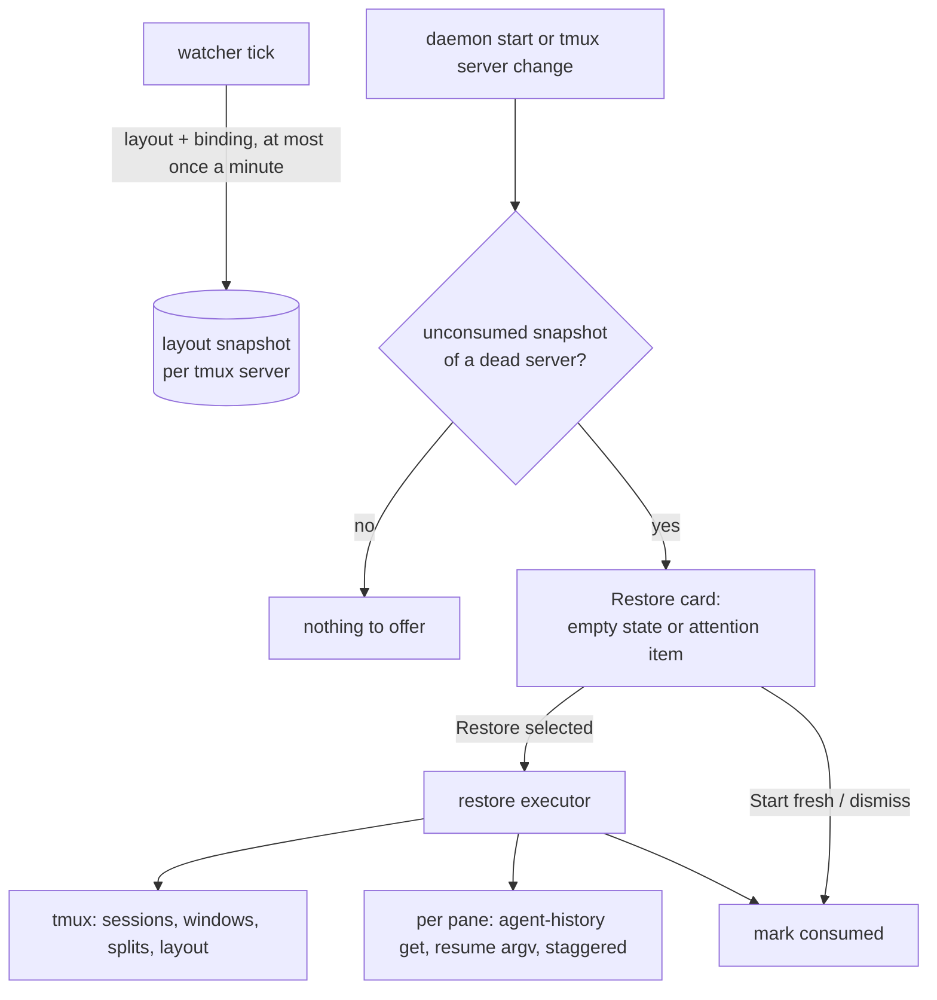

# Restoring the workspace after a reboot

Status: **draft / design**, no code yet. Step zero, starting a tmux session from the
phone when none exists (the "Start a tmux session" empty state), is being built
separately. This note designs what comes next: bringing back the workspace that was
running before the tmux server went away.

## Problem

A tmux server is one process holding every session, window and pane. A reboot, a crash,
an OOM kill or a stray `kill-server` takes all of it, including the coding agents. Their
conversations survive, since each harness keeps its transcript on disk, but the
workspace does not: which agents ran where, arranged how, and which of them mattered.

On 2026-09-30 an agent cleaning up a throwaway demo killed the user's main tmux server
(AGENTS.md, "Never kill the user's tmux server"): 47 panes, 29 Claude Code, 14 Codex, and
shells. Recovery meant searching `~/.claude/projects` and `~/.codex/sessions` through
agent-history and resuming sessions one at a time into windows rebuilt by hand. Two
lessons. The information needed already existed, scattered across the harnesses' session
stores, but nothing tied it to the layout it came from. And not everything should have
come back: some sessions were days stale or finished, and resuming them added noise the
user then had to prune again.

The daemon is in the right place to fix both. It watches every pane, knows each pane's
tool and when it last changed, can learn through agent-history which conversation a pane
holds, and keeps running when tmux does not.

## Goals and non-goals

Goals:

- **Restore the layout:** sessions, windows, pane order and geometry, names, and each
  pane's working directory.
- **Restore agents into their conversations** by running the harness's resume command for
  the session the pane held. Re-running the original command line starts a blank one.
- **Don't resume what is stale or finished.** The user chooses; defaults informed by
  recency make the common case one tap.
- **One mechanism for every cause:** reboot, tmux crash, accidental `kill-server`.
- **Serve hosted boxes too**, which reboot, or outlive their suspend limit, the same way.

Non-goals:

- **Reviving processes.** Memory is gone. We restore conversations, which harnesses keep
  on disk, and places, which are directories. No CRIU-style checkpointing.
- **Re-running arbitrary programs.** `make deploy`, `vim` or `tail -f` come back as a shell
  in the right directory with a note saying what ran there. Replaying an unknown command
  line is how a restore deploys twice.
- **Screen contents.** The transcript is the durable record; the resumed harness redraws it.
- **Unattended restore.** Nothing comes back without a person's say-so. Autostart for
  declared long-running agents is a later, per-agent opt-in.

## What to snapshot

### What is recorded today, and why it is not enough

`history.sqlite3` ([pane-history.md](pane-history.md)) holds two relevant things.

- **Inventory intervals** record, per pane, a key (tmux server id, pane id, pane pid), the
  session name, tool, folded state and sub-agent counts. No window index, pane order,
  layout, directory or title. They exist to draw the fleet chart, and adding layout would
  turn a deduplicated, rarely changing payload into one that changes on every resize.
- **Pane checkpoints** ([activity-clock-persistence.md](activity-clock-persistence.md))
  hold each pane's activity clocks and last card. They are the right *signal* for
  staleness but the wrong *store*: they are pruned once their tmux server is provably
  gone, and after a reboot the first tick that sees any new server does exactly that,
  including the server the empty-state button just started. An offer built on them would
  vanish the moment the user opened a fresh shell.

Everything else is already read on every tick: `list-panes` returns session, window index
and name, pane index, current path, current command, title and pid. Missing are a few more format fields (the session's creation path, the
window's layout string, zoom flag and automatic-rename setting) and the agent session
binding.

### The new record: one layout snapshot per tmux server

One row per tmux server, replaced in place: current state, not history, like the
checkpoint table. It holds each session (name, creation directory, and its session
group, if any); each window (tmux window id, index, name, whether that name was set
by hand or by tmux's automatic renaming, tmux layout string, active, zoomed); and each
pane (index, active, directory, title, classified tool, the basename of the program in
its foreground (never its arguments), and for agents the **binding**: harness and
session id). Each pane also carries a **copy** of its last
activity time and folded state, coarse to the minute. The copy keeps the snapshot
meaningful after checkpoints are pruned; the coarseness keeps it from rewriting on every
keystroke.

**Grouped sessions** share their windows, and `list-panes -a` reports a shared pane once
per member; the watcher already folds those copies into one. The snapshot does the same:
each shared window is stored once, under the group, and the other members are recorded
as names only. Restore builds the windows once and creates the other members as
members of that group, so a shared agent is never resumed twice. **Linked windows**
(`link-window`) are the same sharing without a group: `list-panes -a` again repeats the
pane, but `session_group` is empty. So windows are keyed by their tmux id, each session
records which window ids it shows at which index, and restore builds a shared window once
and links it into the other sessions. Folding by pane id alone would lose the second
session's link, and keeping both copies would resume the agent twice.

**Server identity** is the boot id plus the server's pid *and its process start time*.
History keys on boot id plus pid, and there a reused pid only keeps a dead server's rows
a little longer. Here it would be worse: a later server that drew the same pid in the
same boot would overwrite the only restore candidate, and an unrelated process holding
that pid would make a dead server look alive and suppress the offer. The start time
(field 22 of `/proc/<pid>/stat`, the check agent-history already makes for Claude's
registry) closes both.

The payload is rewritten only when it changes. Its **last-seen** stamp is refreshed every
minute regardless, the cadence the inventory heartbeat already keeps, because it is the
proxy for when the server died: an unchanged server can run for days, and staleness must
be measured from its end, not from its last layout change. Fifty panes are a few tens of
kilobytes; the cost is one small update a minute.

**Retention.** When a server dies its row stays as the restore candidate, stamped with
when it was last seen. Only the newest dead server's snapshot is offered; older ones are
dropped after 30 days, enough to get back from a long weekend. Unlike inventory intervals
they are not kept forever, because nobody restores a month-old layout. A **consumed**
mark (restored or dismissed) keeps the offer from reappearing.

### Binding a pane to its conversation

This is what resurrect-style tools cannot do, and the only part needing new plumbing.
agent-history already computes the binding to stop a second copy of a running session:
it reads Claude Code's process registry, which records each live session's pid and tmux
pane, and for Codex and omp the transcript files their processes hold open. Live Mode's
`resume_session` uses it, and also checks that the agent's pid descends from the pane's
process, since a pane id from another server would otherwise match by accident.

The snapshot needs the inverse, every live session with its pane, in one call: a listing
in agent-history in the shape `get` already returns. The daemon calls it once a minute,
not per tick, and keeps the last good binding per pane. Codex sessions behind the shared
app-server have no pane (agent-history's README explains why); for them the watcher falls
back to the status-bar `session-id` match Live already uses ([agent-setup](../agent-setup.md)).
A Codex pane with neither stays *unbound*: restore still knows it was Codex in that
directory and offers a picker of that directory's recent threads instead of guessing.

A binding is dropped when the agent exits and the pane returns to a shell. An agent the
user closed is finished by definition.

## Detecting that a restore is due

The daemon cannot see a reboot, only what one leaves behind. It finds the newest
snapshot whose server is dead, consumed or not, and offers it only if it is unconsumed.
Two details matter. Live rows are skipped: a replacement server has usually written its
own, newer row by the time anyone looks, and it must not hide the dead one behind it.
Consumed rows are not: once the newest loss has been restored or dismissed, an older one
must not surface in its place. A server is judged by comparing its identity with the
present:

- **Boot id differs** (`/proc/sys/kernel/random/boot_id`): the machine rebooted.
- **Same boot, server process gone:** tmux crashed or was killed.
- **That server still alive:** skip it. This is what keeps a daemon restart,
  which every integration deploy causes, from looking like a lost workspace.

Both loss cases get the same offer, worded differently. The offer does **not** require
tmux to be absent: many setups start a session at login, so after a reboot there is often
a fresh server with one shell, and an offer tied to the empty state would never show. The
empty state is where the card is most prominent; with a server present it appears as one
attention item at the top of the list.

### The Restore card

The card groups the snapshot as tmux did: sessions, windows, panes. Each pane shows its
tool icon, title, directory and how long it had been idle when the server died, with a
checkbox; sessions and windows have tri-state checkboxes over their panes.

**Defaults decide whether a restore is one tap or forty.** A pane is checked when its
agent was working, waiting on the user, or active in the last 24 hours; unchecked when
idle longer, or a shell with nothing running. Staleness is measured **from when the
server died, not from now**: a machine powered off all weekend should still treat Friday
afternoon's work as recent.

Panes that cannot be restored are shown disabled, with the reason: the directory is gone;
the transcript is gone (agent-history's `source_missing`); or the session is already
running, say because the user resumed it by hand, using the same running check as Live's
resume; or whether it is running cannot be established (agent-history's
`running_unknown`). Live's resume refuses that last case rather than risk two processes
writing one transcript, so the card must not offer a restore the executor would reject.

**Restore selected** states the count ("Restore 11 agents in 4 sessions"). **Start
fresh** marks the snapshot consumed and, when no tmux server is running, hands off to the
empty state's "Start a tmux session". When a replacement server is already up, the fresh
workspace already exists, so the same action reads **Keep current** and only consumes the
snapshot. Starting yet another session there would be no equivalent. The card reuses the existing list and checkbox chrome; phones collapse to
session level by default, the wide layout shows panes expanded.

## Restore mechanics

### Building the layout

The executor does what a person would. For each selected session, in snapshot order, it
creates the session with its first pane in that pane's directory, adds each window at its
original index, splits off the window's panes in order, each in its own directory, then
applies the saved layout string for exact geometry. A deselected pane makes the layout
string's pane count wrong and tmux rejects it, so that window falls back to the nearest
built-in layout rather than failing. Names, the active window and pane, and zoom go last.
A window whose name was set by hand gets automatic renaming turned off before its name is
applied; otherwise tmux renames it after the agent's process the moment it starts (the
[orchestration notes](../agent-orchestration.md) describe the same clobbering). Windows
that were auto-named stay that way.

A session name that already exists (a login script's, typically) is never merged into;
the restored session gets a suffix, because a restore that rearranges a live session is
worse than an ugly name. A pane whose directory has moved is skipped and reported, never
started in `$HOME`: an agent resumed in the wrong directory cannot find its session.

### Who owns the new server

A constraint shared with step zero. The daemon is a systemd user unit whose kill mode is
the whole control group, and a tmux server it forks lives in that group. Every
integration deploy restarts the daemon, so a server started the obvious way would be
killed, restored agents and all, on the next deploy: the incident again. The server must
start in its own scope or unit.

It also must not inherit the unit's deliberately minimal PATH, under which an
nvm-installed `claude` does not resolve. Panes start under the user's login shell, which
receives the resume argv as positional arguments, runs it, and then continues as an
interactive shell in the same directory. PATH comes from the user's profile; the
arguments are never parsed as shell syntax, the promise agent-history's `resume_argv`
makes; and when the agent exits, normally or at once, the pane survives as a shell
instead of closing and taking its place in the layout with it.

### Per pane

- **Agent panes** run the bound session's resume argv, fetched fresh from agent-history at
  restore time and gated by the daemon's known-resumable list, so nothing from the
  snapshot beyond a session id reaches a command line. The index produces `claude
  --resume <id>`, `codex resume <id>` and `omp --resume <id>` today. OpenCode and Gemini
  have no reader yet; their panes return as shells in the right directory with a note
  naming the tool. Resume restores the conversation, not launch flags: a pane started as
  "Claude (Fable)" returns on the default model. Accepted, because permission flags in
  particular should not survive a reboot silently.
- **Shell panes** get the user's shell in the saved directory.
- **Anything else** gets a shell there, with a one-line hint naming what used to run. The
  program is never re-run.

### Pacing, failures, idempotency

Agents start **a few at a time** (three by default), each counted as started only when it
reaches its input line or a first-run prompt, as the
[orchestration notes](../agent-orchestration.md) learned the hard way. Forty Node
processes at once fight for CPU and memory on a just-booted machine and hit the
provider's session-start rate limits together. Order: panes waiting on the user, then
working, then by recency. The layout is built up front, so every pane exists at once and
agents fill in as their turn comes. Readiness has a bound, about a minute: an agent that
is still alive but has shown neither its input line nor a recognized prompt by then is
marked as needing attention, and its slot passes to the next one, so a few hung starts
cannot stall the rest of the queue.

An agent that exits at once stays in the layout as the shell its launcher falls back to,
with the error above the prompt, and the card reports it. A login or first-run prompt is
different: the agent is alive and waiting, so no shell can take over. That pane stays as
it is, counts as started (it reached a prompt, which frees its slot), and is marked as
needing attention, because a login is a human boundary anyway. No retries.

**Idempotency** rests on a durable restore run. In one transaction, before anything
launches, the daemon records the run (the exact selection, each selected pane pending)
and marks the snapshot consumed *by that run*; a dismissal consumes it with no run. A
second tap or device is therefore told a restore is running. Layout construction is
recorded too: each session, window and pane the executor creates is written to the run
by its tmux id as it is created, and each launch outcome (pid, or the failure) as it
lands. A daemon that restarts mid-restore finds the unfinished run, reconciles those ids
against tmux (reusing every target that still exists, rather than meeting its own half
built session as a name collision and suffixing it), creates what is missing, and
launches what is pending.
The audit trail is not this record: it is telemetry, for reconstruction afterwards,
not state an executor can resume from. And right before each launch the running check
runs again, so a session resumed by hand meanwhile is skipped. That check and its lock
come from Live's `resume_session`, which today always opens a new window. They move into
one shared primitive, "start this session in this pane unless it is already running",
that takes a target pane: Live passes a pane it just opened, restore passes the prebuilt
one, which the primitive respawns with the launch command. One path, not two.

**Audit.** Each launch writes the record Live's resume writes (actor, harness, session id,
directory, pane), and the restore writes one record of the selection.

## Safety

**Restoring launches agents, and agents act.** A resumed Claude Code or Codex session
waits for input rather than continuing its last turn, but harnesses can be configured to
approve on their own (auto mode, bypass settings), and a person may start a restore and
walk away. So restore is an explicit, confirmed action whose button states the count, and
the daemon never restores anything on its own, not even "just the layout": a daemon that
rebuilds unprompted will one day rebuild the wrong thing.

**No command line or environment is persisted.** The snapshot stores directories, titles,
tool names and session ids: never a pane's command line, `/proc` cmdline or environment,
any of which can carry a token typed inline. The resume command is rebuilt from the index
at restore time. Titles are the exception that cannot be ruled out: they are agent-chosen
text and could hold a secret. They are kept because the card needs them to be
recognisable, so they are stored only where all history is (a `0700` directory with
`0600` files) and shown only on the user's own Restore card, and they are never written to
logs or telemetry.

**Permissions do not come back on their own.** Resume argv carries no permission flags,
so an agent launched with skip-permissions returns in its harness's configured default.
If the user's own settings default to an auto mode, the agent runs that way: their
standing configuration, accepted at the confirm step.

**Sessions resumed elsewhere.** The running check sees this host's processes, so a
transcript an IDE or a hand-typed resume holds open is not restored twice. It cannot see
another machine; hosted boxes keep transcripts on their own disk, so that case does not
arise here.

## Alternatives considered

**tmux-resurrect with continuum.** Resurrect saves the layout half (sessions, windows,
panes, layout strings, directories, optionally contents); continuum saves on a timer and
can auto-restore when tmux starts. Its program restore re-runs a saved command line from
an allowlist, which for a coding agent means a blank conversation: the conversation lives
in the harness's store, not the command line. The usual workaround maps `claude` to
`claude --continue`, which resumes the *most recent* conversation in the directory, so
with several agents per repository, the normal case here, every pane resumes the same
one. No staleness, no phone UI, and auto-restore without asking. The daemon already reads
everything resurrect saves, so adopting it adds a second, plugin-private record and still
lacks the hard part. We take its technique (replay the layout string), not the tool.

**A systemd user unit per agent.** Agents need a terminal and a person, so they would
still run inside tmux; a unit per short-lived agent is heavy, and restarting them
unattended is what we rejected. Right only for declared long-running agents: phase
three's manifest autostart.

**Make reboots rarer.** Lingering is on, and tmux in its own unit (needed anyway, above)
survives logouts and daemon restarts. Worth having, but kernel updates, power loss and
the `kill-server` that started this still happen. Fewer losses still need recovery.

**Hosted boxes with suspend.** Suspend keeps RAM, so tmux survives, and the hosted plan
([querystory/planning#488](https://github.com/querystory/planning/pull/488)) makes it the
default for idle boxes. But suspension has a time cap, some machine shapes lack it, and a
workstation has none. A box past the cap reboots and needs exactly this. Suspend makes
restore rarer; it doesn't replace it.

**CRIU-style process checkpointing.** Fragile with open connections to model APIs, and
unnecessary when the harness already wrote the conversation to disk.

**Auto-restore everything.** The simplest UI; the incident is the argument against it.

## How this meshes with openbus

The hosted-box plan (#488) lists this as workstream D and asks three contracts of it.

- **Event envelope.** Identity is the agent session, the pane its current location. The
  snapshot's durable key for an agent pane is likewise the harness session id, and each
  restored pane emits a `resumed` lifecycle event.
- **Audited action path.** "Resume" is a verb in the action vocabulary; restore is that
  verb many times over, through the one path that records actor and confirmation tier.
  The card's confirm button is the tier.
- **Agent manifest.** Grown from `TMUXRC_LAUNCHERS`, it carries a restart and resume
  policy. A manifest agent marked `autostart` is the one sanctioned exception to "never
  without consent", in phase three; everything else stays an offer.

Cross-agent connect ([#308](https://github.com/querystory/tmux-rc/pull/308)) stores grants
by harness session id so they survive a resume: a restored session keeps its grants, and a
new agent in a recycled pane id does not inherit them.

## Phased plan

- **P0 (in progress, separate PR):** start a tmux session from the phone when none exists.
  It brings the empty state and session creation, and must meet the server-ownership and
  PATH constraints above.
- **P1:** snapshot and binding, detection, the Restore card with defaults, the paced
  executor.
- **P2: smarter defaults.** A pane whose PR merged is finished
  ([pr-association-lifecycle.md](pr-association-lifecycle.md)); a pane the user was
  viewing is active; agent-history's last-active time fills in a missing clock. OpenCode
  and Gemini resume as agent-history gains readers.
- **P3: hosted boxes.** Manifest autostart, restore as the fallback after a suspend past
  its cap, surfaced as a box-level attention item.

### The first PR

It records snapshots and restores nothing. A snapshot helps only if it was being written
*before* the next lost server, which is not scheduled. Shipping the recorder first means
the restore half lands with real data from the user's own fleet to test against.

Scope: the snapshot table (a new schema migration), the new fields in the pane listing
(session path, window layout, zoom, automatic rename, foreground program),
agent-history's live-session listing and the once-a-minute binding, the consumed mark,
and a read-only endpoint returning the latest dead-server snapshot with each pane's
computed default, so the card's data can be checked by hand before the card exists.

Acceptance:

- Against an isolated test tmux server (its own socket, as the existing tmux tests do,
  never the user's), the snapshot reproduces sessions, window indexes, names, layout
  strings, zoom, rename settings, pane order and directories exactly.
- Bound Claude, Codex and omp panes record the session id agent-history reports; an
  unbound Codex pane records tool and directory with no id.
- An unchanged fleet rewrites no payload, only the minute last-seen stamp; resizing a
  pane rewrites it once.
- After the test server is stopped by its own socket, the endpoint returns its snapshot as
  a candidate, even after a second test server has written a newer row; a daemon restart
  with the server alive returns none.
- Grouped sessions record each shared window once, with the other members by name; a
  window linked into two ungrouped sessions is recorded once and relinked on restore.
- A server identity whose pid now belongs to a different process (a different start
  time) counts as dead, and a new server reusing a dead one's pid gets its own row.
- A new tmux server appearing does not delete the previous server's snapshot, the
  checkpoint table's failure mode.
- No command line, cmdline or environment value reaches the database; a test asserts it
  against a pane started with a secret-looking argument.
- `make test lint` passes.
