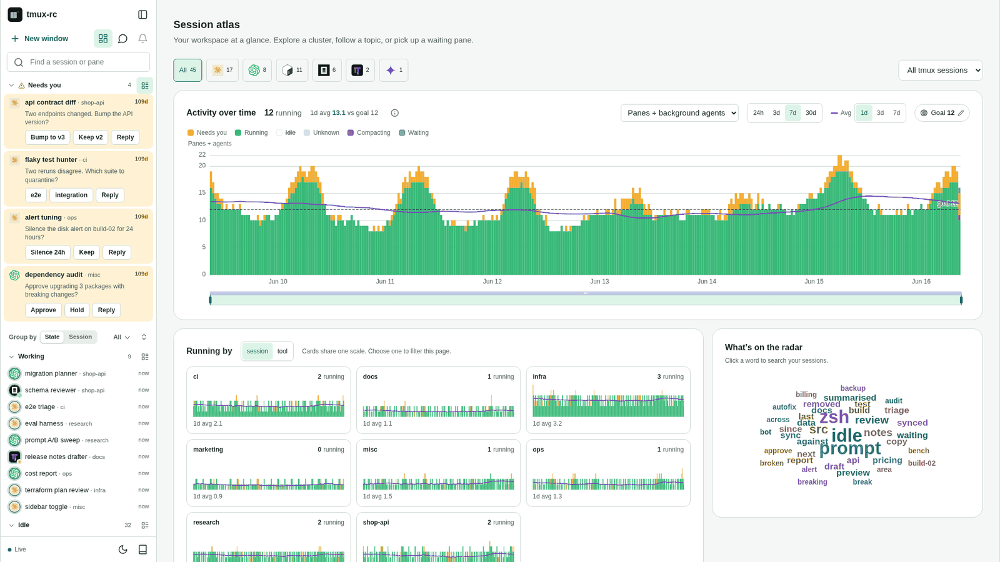
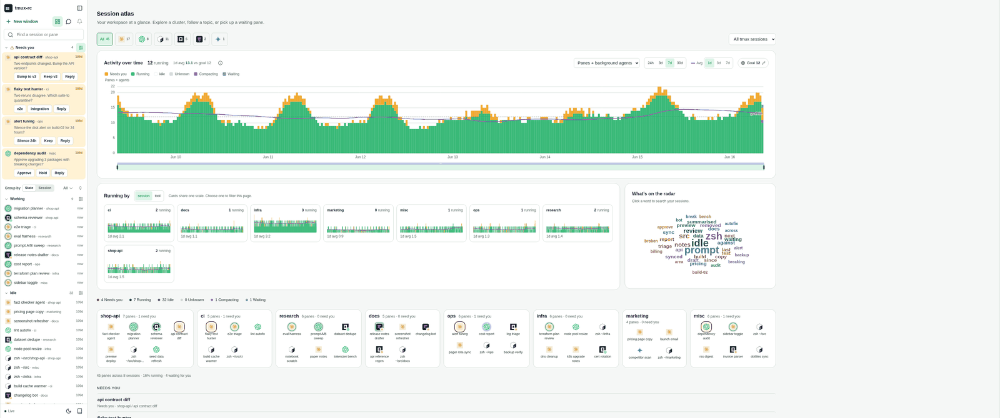
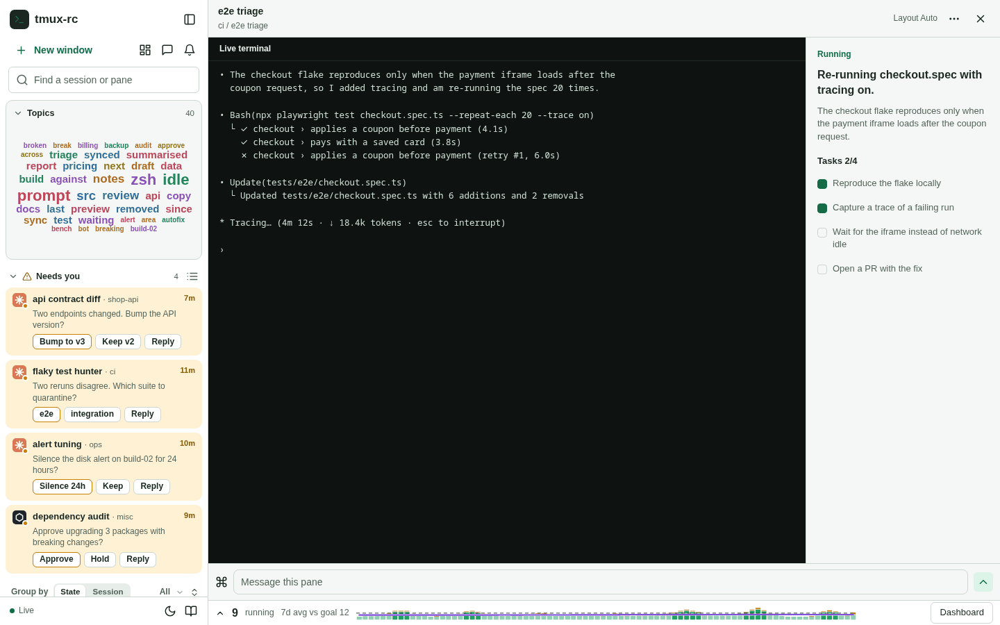
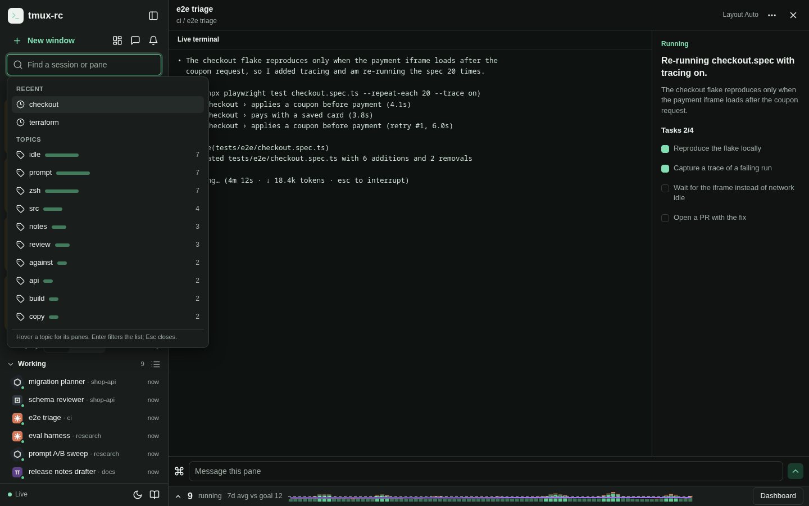
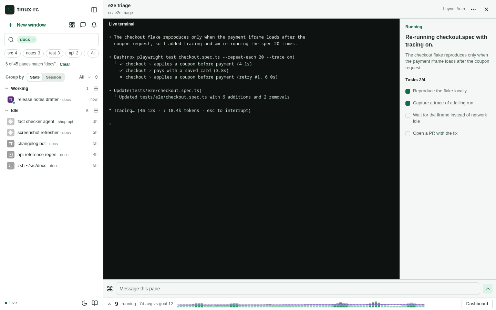
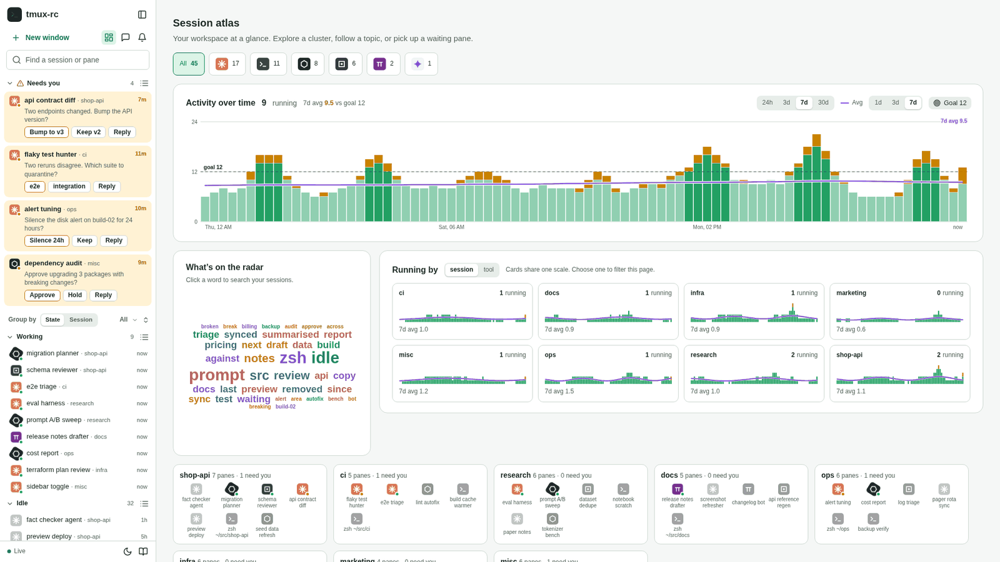
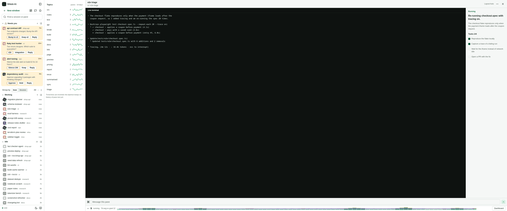
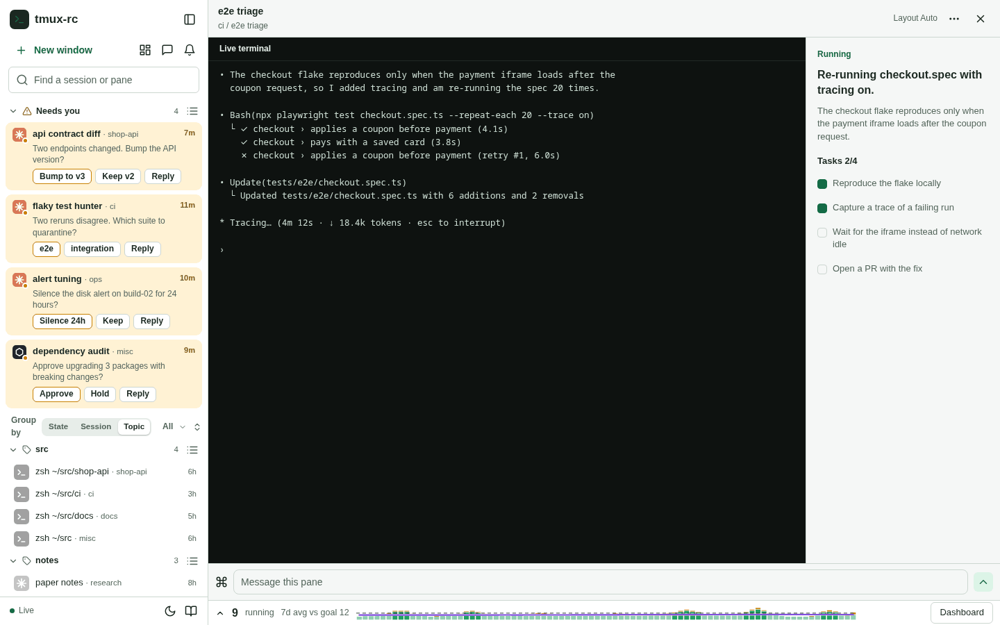
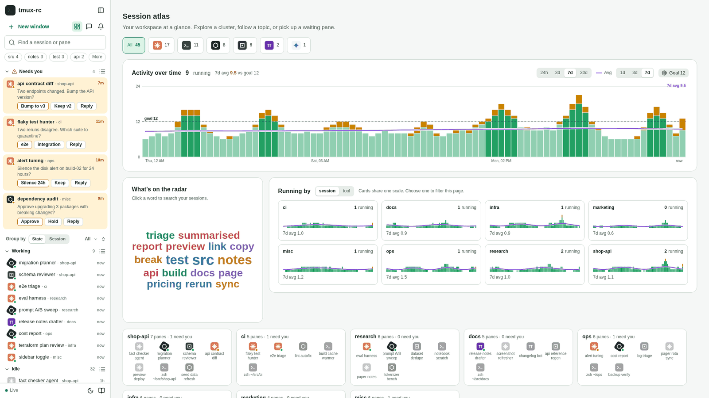
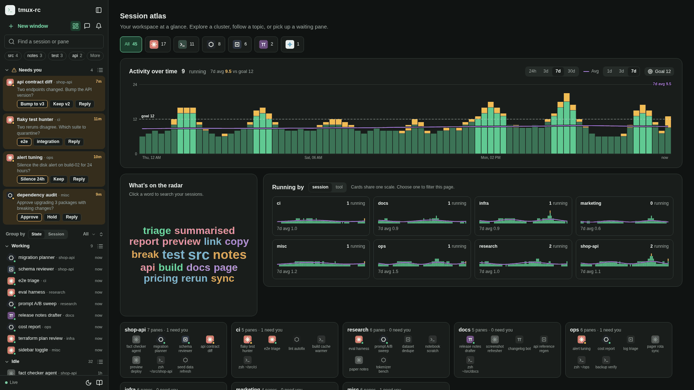

# Where topics live, and how they are computed

Status: design exploration, round 4 of the [UI design process](ui-design-process.md).
Nothing here is built. The mocks are round 4 of the
[fleet layout studies](../fleet-layouts.html#T7) (open the page and pick T0 to T7); a
follow-up PR would build the recommendation at the end.

## The problem

The dashboard (the "Session atlas" from #299) has a word cloud titled "What's on the
radar". Clicking a word types it into the search box at the top of the sidebar (#298), and
the sidebar list filters to the panes that mention it. The cloud is a remote control for
the list.

On a wide screen the remote control sits at the opposite end of the room. At 1920 pixels the
cloud starts about 1,070px to the right of the sidebar; at 2560 and 3440 it is 1,700 to
1,850px away. It also took 536px from the "Running by" small multiples beside it, so eight
session cards wrap as 3, 3 and 2 at 1920 and as 6 and 2 at 2560: an orphan row. At 1280 by
800 the row stacks and the cloud starts at y=1,201 in the real app, well below the fold. And
because it lives on the dashboard, the moment you open a pane there are no topics anywhere.

On a huge screen it "almost makes more sense to be in the sidebar", where you could search
and get some insight without opening a pane, though it is not obvious we want that. The
words themselves are also weak. In the shipped
cloud on the demo fleet the three biggest words are *idle*, *prompt* and *zsh*. They come
from shells whose summary is "Idle at the prompt", not from anything the agents are working
on. Moving a bad list closer to the sidebar does not make it useful, so this round covers
both where topics are shown and how they are computed.

## How this round was run

The earlier rounds mocked layouts that did not exist yet. This one varies a layout that
does, so every frame is the shipped sidebar and dashboard redrawn in the mock page, filled
with the demo fleet that `make screenshots` serves (45 panes in eight sessions, invented
names like shop-api and ci). Real screenshots of integration, shot from that same fleet, were
kept beside the mocks while building them. The mock reproduces the shipped word counting,
so the cloud in frame T0 holds the same 40 words as the real one.

Each frame is interactive enough to judge: click a topic and the list filters, with the
topic shown as a pill in the search box; click the search box where a variant has
suggestions; switch Group by. A toolbar switch flips every frame between the shipped word
list and a cleaned one (below).

Every frame was then rendered at 1280x800, 1440x900, 1920x1080, 2560x1440 and 3440x1440
(plus dark mode at 1920) and measured in the page rather than by eye: distance from the
topic control to the list, how far the list is pushed down, how many list items stay in
view, the smallest topic label and how many labels are actually on screen, the empty share
of the dashboard (points sampled every 24px that land outside every card), and anything
that wraps or orphans. Where the real app could be measured the same way it agrees with the
mock: the shipped cloud starts 1,067px from the sidebar at 1920 in the app and 1,070px in
the mock, and 1,849px at 3440 in both.

## The options

**T0, shipped.** The baseline above: a big canvas, but far from the list, below the fold on
short screens, dashboard-only, and the cause of the orphan row.

**T1, the cloud as a sidebar section.** The same cloud at 266 by 190 between the search and
the list. The gap drops to zero and topics exist with a pane open, but the section pushes
the list down 238px. On a 1280x800 screen that leaves three list items in view instead of
seven. The sizing rule bottoms out at 18px for the largest word and 10px for the rest, so the
cloud loses the size differences that make it a cloud.

**T2, topics inside the search box.** Nothing new at rest. Focusing the empty search opens
a suggestion list: two recent searches, then the top ten topics, each with its pane count and
a bar. It costs no sidebar height, puts topics where you already go to filter, and a ranked
list reads better than a cloud (13px labels, the count as a number rather than a font
size). The cost is discovery: a topic you did not know to look for never shows up, which was
the point of "on the radar".

**T3, a one-line chip strip under the search.** The top topics as chips with counts in one
26px row. The active topic becomes a pill in the search field, and "All" opens the dashboard
cloud. It is always visible and adjacent to the list for 34px of height, and chips stay
12px at any width. But the sidebar is 300px at every screen size, so only four chips fit,
and on the shipped word list those four are *idle, prompt, zsh, src*. The strip only works
with a cleaned list.

**T4, the cloud leads the Running-by row.** The cloud swaps sides and becomes the first card
under the chart, 33px from the sidebar instead of 1,070. The session cards are also
balanced (4 and 4 instead of 3, 3 and 2), which removes the orphan row at every width but
1280, where eight cards in at most three columns cannot balance. It is still dashboard-only
and still under the chart, so on 800 and 900px-tall screens it sits at the bottom edge.

**T5, a docked topics panel on ultra-wide screens.** From 2,400px wide, a 280px panel docks
between the sidebar and the work area: every topic as a row with its count and a 14-day trend
line, with hover listing its panes. Below 2,400 it falls back to T3's strip. It spends width
ultra-wide screens waste, and a trend answers "what is new" rather than "what is big". But
it is a third column to scan, for screens few people have, and the mock's trends are
invented: the daemon's history records pane states, never pane text, so trends need new
storage before new UI.

**T6, Group by Topic.** Topic becomes a third Group by mode beside State and Session; each
pane sits under its most common shared topic, and grouped by session each header shows its
top two topics. It adds no chrome and reads as a table of contents. In practice it shows
how fragile the words are: on the shipped list the biggest group is *idle*, and the running
"e2e triage" pane lands in it because its summary mentions waiting for "network idle". Topics
overlap but a pane sits in one group, so the primary topic is arbitrary, and the third
segment makes the "Group by" label wrap.

**T7, the combination.** T3's strip for a glance, T2's suggestions behind "More" and the
search box, and T4's dashboard. Topics are one line from the list whether or not a pane is
open, the cloud stays as the browsing view but next to the sidebar, and the small multiples
stop orphaning. All three surfaces show one list, so they must come from one function.

Other ideas were weighed and not mocked. Topics on each tmux-session group header are T6's
session mode. A "what changed today" strip in the empty work area needs the same text
history as T5's trends. Hover-to-preview is in every variant as a tooltip listing a topic's
panes.

## Measurements

All variants with the shipped word list (light theme). Dark mode was shot at 1920 for every
frame and measured the same; it changes no layout number. The same table is at the bottom
of the mock page.

| Variant | Screen | Gap to list | Topics start at y | Sidebar cost | List items in view | Smallest label | Labels in view | Empty work area | Wraps and orphans |
|---|---|---|---|---|---|---|---|---|---|
| T0 Shipped | 1280x800 | 134px | 889 (below fold) | +0px | 7 | — | 0 of 40 | 18% | orphan row 2 of 3; cloud below the fold |
| T0 Shipped | 1440x900 | 691px | 441 | +0px | 10 | 10.6px | 40 of 40 | 20% | — |
| T0 Shipped | 1920x1080 | 1,070px | 481 | +0px | 14 | 11.9px | 40 of 40 | 16% | orphan row 2 of 3 |
| T0 Shipped | 2560x1440 | 1,709px | 481 | +0px | 26 | 11.9px | 40 of 40 | 29% | orphan row 2 of 6 |
| T0 Shipped | 3440x1440 | 1,849px | 481 | +0px | 26 | 11.9px | 40 of 40 | 46% | orphan row 1 of 7 |
| T1 Sidebar cloud | 1280x800 | 8px | 144 | +238px | 3 | 10px | 40 of 40 | pane open | — |
| T1 Sidebar cloud | 1440x900 | 8px | 144 | +238px | 4 | 10px | 40 of 40 | pane open | — |
| T1 Sidebar cloud | 1920x1080 | 8px | 144 | +238px | 8 | 10px | 40 of 40 | pane open | — |
| T1 Sidebar cloud | 2560x1440 | 8px | 144 | +238px | 18 | 10px | 40 of 40 | pane open | — |
| T1 Sidebar cloud | 3440x1440 | 8px | 144 | +238px | 18 | 10px | 40 of 40 | pane open | — |
| T2 Search suggestions | 1280x800 | 10px | 96 | +0px | 7 | 13px | 10 of 10 | pane open | dropdown covers Needs you while open |
| T2 Search suggestions | 1440x900 | 10px | 96 | +0px | 10 | 13px | 10 of 10 | pane open | dropdown covers Needs you while open |
| T2 Search suggestions | 1920x1080 | 10px | 96 | +0px | 14 | 13px | 10 of 10 | pane open | dropdown covers Needs you while open |
| T2 Search suggestions | 2560x1440 | 10px | 96 | +0px | 26 | 13px | 10 of 10 | pane open | dropdown covers Needs you while open |
| T2 Search suggestions | 3440x1440 | 10px | 96 | +0px | 26 | 13px | 10 of 10 | pane open | dropdown covers Needs you while open |
| T3 Chip strip | 1280x800 | 10px | 142 | +34px | 5 | 12px | 4 of 8 | pane open | 4 of 8 chips fit |
| T3 Chip strip | 1440x900 | 10px | 142 | +34px | 9 | 12px | 4 of 8 | pane open | 4 of 8 chips fit |
| T3 Chip strip | 1920x1080 | 10px | 142 | +34px | 13 | 12px | 4 of 8 | pane open | 4 of 8 chips fit |
| T3 Chip strip | 2560x1440 | 10px | 142 | +34px | 24 | 12px | 4 of 8 | pane open | 4 of 8 chips fit |
| T3 Chip strip | 3440x1440 | 10px | 142 | +34px | 24 | 12px | 4 of 8 | pane open | 4 of 8 chips fit |
| T4 Cloud leads row | 1280x800 | 33px | 441 | +0px | 7 | 12.1px | 40 of 40 | 18% | orphan row 2 of 3 |
| T4 Cloud leads row | 1440x900 | 33px | 441 | +0px | 10 | 12.8px | 40 of 40 | 18% | — |
| T4 Cloud leads row | 1920x1080 | 33px | 481 | +0px | 14 | 10px | 40 of 40 | 19% | — |
| T4 Cloud leads row | 2560x1440 | 33px | 481 | +0px | 26 | 10px | 40 of 40 | 30% | — |
| T4 Cloud leads row | 3440x1440 | 33px | 481 | +0px | 26 | 10px | 40 of 40 | 46% | — |
| T5 Ultra-wide panel | 1280x800 | 10px | 142 | +34px | 5 | 12px | 4 of 8 | pane open | 4 of 8 chips fit |
| T5 Ultra-wide panel | 1440x900 | 10px | 142 | +34px | 9 | 12px | 4 of 8 | pane open | 4 of 8 chips fit |
| T5 Ultra-wide panel | 1920x1080 | 10px | 142 | +34px | 13 | 12px | 4 of 8 | pane open | 4 of 8 chips fit |
| T5 Ultra-wide panel | 2560x1440 | 1px | 0 | +0px | 26 | 13px | 26 of 26 | pane open | — |
| T5 Ultra-wide panel | 3440x1440 | 1px | 0 | +0px | 26 | 13px | 26 of 26 | pane open | — |
| T6 Group by Topic | 1280x800 | 0px | 594 | +0px | 7 | — | — | pane open | Group by label wraps (3 segments) |
| T6 Group by Topic | 1440x900 | 0px | 594 | +0px | 10 | — | — | pane open | Group by label wraps (3 segments) |
| T6 Group by Topic | 1920x1080 | 0px | 594 | +0px | 13 | — | — | pane open | Group by label wraps (3 segments) |
| T6 Group by Topic | 2560x1440 | 0px | 594 | +0px | 22 | — | — | pane open | Group by label wraps (3 segments) |
| T6 Group by Topic | 3440x1440 | 0px | 594 | +0px | 22 | — | — | pane open | Group by label wraps (3 segments) |
| T7 Strip + suggestions + T4 | 1280x800 | 10px | 142 | +34px | 5 | 12px | 43 of 48 | 18% | orphan row 2 of 3; 3 of 8 chips fit |
| T7 Strip + suggestions + T4 | 1440x900 | 10px | 142 | +34px | 9 | 12px | 43 of 48 | 18% | 3 of 8 chips fit |
| T7 Strip + suggestions + T4 | 1920x1080 | 10px | 142 | +34px | 13 | 10px | 43 of 48 | 19% | 3 of 8 chips fit |
| T7 Strip + suggestions + T4 | 2560x1440 | 10px | 142 | +34px | 24 | 10px | 43 of 48 | 30% | 3 of 8 chips fit |
| T7 Strip + suggestions + T4 | 3440x1440 | 10px | 142 | +34px | 24 | 10px | 43 of 48 | 46% | 3 of 8 chips fit |

What the table says:

- **Distance is binary.** Sidebar variants sit within 10px of the list; T0's gap grows with
  the screen, from 690px to 1,850px. T4 and T7 bring the dashboard cloud to 33px.
- **Height is the real sidebar cost.** T1's 238px costs about half the visible list on
  laptops (3 items instead of 7 at 1280). The strip's 34px costs one or two. T2 costs nothing.
- **Lists read better than clouds.** Chips and suggestions hold 12 to 13px everywhere; clouds
  fall to 10px in a 266px sidebar or a 380px card.
- **The orphan row is a dashboard bug.** Balancing the cards fixes it at every size but 1280,
  whatever happens to the cloud.
- **Ultra-wide waste is the dashboard's max width.** 46% of the work area is empty at 3440 in
  every dashboard variant; only T5 spends that width.

## How topics are computed

Today's cloud is built in the browser on each render: take each pane's title and its summary
(or status line), split it into words of three or more letters, drop a stoplist of about 100
English and agent-narration words, count how many panes use each word, and show the top 40.
It is simple and fast, and it fails in three predictable ways:

- **State words win.** "Idle", "prompt", "waiting", "running" and shell names describe what
  a pane is doing, not what it is about, and every idle shell repeats them. On the demo fleet
  9 of the top 15 words are state or narration words; on the live fleet 6 of 15 are.
- **Fragments count as topics.** "src" (from shell paths), "build-02", "against", "since"
  and "next" pass because the rule cannot tell a path or a preposition from a subject.
- **Singletons dominate the tail.** Most words appear in exactly one pane: 176 on the demo
  fleet, 391 on the live one. A word only one pane uses is that pane's name, not a topic.

Candidate fixes, from cheapest to most capable:

- **A domain stoplist and folding.** Add state and narration words, drop tokens with digits,
  fold plurals and tenses, and require at least two panes per topic. It is a few lines in the
  existing function. On the demo fleet the top 15 become *src, notes, test, api, break,
  build, copy, docs, link, page, preview, pricing, report, rerun, summarised*: no state
  words, though "src" survives as a path fragment. On the live fleet it keeps 8 of the
  current top 15 and removes every state word. Its weakness is that a stoplist is
  whack-a-mole: every new agent brings new boilerplate.
- **TF-IDF across panes.** Weighting a word down when many panes use it removes the
  boilerplate without a hand-made list, but it works against the goal: a topic is
  interesting precisely because several panes share it. On 26 to 45 short summaries it
  mostly reorders the same words. TF-IDF is the right tool across **time**, not across
  panes: weight words up when they are common now and rare last week, and you get "what is
  new today". That needs a history of pane text, which the daemon does not keep (its history
  stores states and counts). So time-based TF-IDF is a storage decision first.
- **Phrases.** Two-word phrases ("copilot review", "agent history") read better, but need
  repetition: no phrase recurs in two panes on the demo fleet, one does on the live fleet.
  Worth adding once the base list is clean, not as a fix on its own.
- **Entities as facets.** Repositories (from the pane's working directory), PR numbers (the
  daemon already links panes to PRs), file names and tool names are better treated as their
  own chip type than as words. On the live fleet 8 of the top 15 entities are shared by two or
  more panes, a stronger signal than any word method. On the demo fleet the repository facet
  just mirrors the tmux session, which is often true of real fleets too.
- **Clustering panes.** TF-IDF vectors with agglomerative clustering were tried on both
  fleets. On one-line summaries the vectors are too sparse. On the live fleet a reasonable
  threshold gives one cluster of two and 24 loners. Lower thresholds give six to eight
  clusters of two to four panes, but their membership changes with the threshold, and none
  spans more than two tmux sessions, so they add little beyond Group by Session. Embeddings
  would group better, but add a model call per pane for a 25 to 45 item problem.
- **LLM-labelled themes.** One cheap call over all current summaries returns five to eight
  named themes with their member panes, the only approach that yields labels a person would
  write ("checkout flake", "API v3 migration") and handles synonyms. It belongs in the
  daemon, which already holds the summaries and the model client, so every browser shows the
  same answer. Recompute at most every 10 minutes or when panes come and go, keep the old
  labels when membership barely changes, and store each run with its timestamp: that is the
  text history trends and "new today" need.

Stability matters as much as quality for a strip in view all day: chips should not reorder
on every poll, so order by count with a fixed tie-break and re-rank at most once a minute.

## Recommendation

**Placement: T7.** A one-line chip strip under the sidebar search, the top topics as chips
with a "More" that opens the same list as search suggestions, and an active topic shown as a
pill in the search field. On the dashboard the cloud moves to the left of the Running-by row,
next to the sidebar, and the session cards balance into even rows. Topics sit within 10px of
the list on every screen for 34px, the large cloud stays for browsing, and the orphan row is
fixed independently. T1 is rejected: half the list on laptops for a worse cloud. T5 and T6
wait for better topics; both look broken on today's words.

**Computation: stage it.** The follow-up PR cleans the existing client-side function (domain
stoplist, digit and path filtering, folding, at least two panes per topic, stable ordering)
and makes it the one source for strip, suggestions and cloud. That is cheap, and the strip
depends on it. Entity facets and LLM themes are the next step, in the daemon, and both
deserve their own design note. The themes call is the point at which a text history exists,
which is what trends, "new today" and a Topic grouping actually need.

## What the follow-up PR would build

It would build:

- One topic function (cleaned) feeding every topic surface.
- The chip strip under the sidebar search, showing the chips that fit, with "More".
- Suggestions on focusing an empty search: recent searches, then topics with counts.
- The active topic as a removable pill in the search field.
- On the dashboard: the cloud moved left of Running by, and balanced session cards.

It would not build: the ultra-wide panel, Group by Topic, trend lines, entity facets,
LLM-labelled themes, any new daemon storage, or any change to the phone layout.

## Open questions

- Should the strip always show, or only when the fleet is big enough to need it (say 15 or
  more panes)? With five panes it is noise.
- Should repositories and PRs appear as chips mixed with words, or as their own row in the
  suggestions?
- Is one model call every ten minutes acceptable for LLM-labelled themes, given that the
  summaries already go to the same provider for classification?
- Should clicking a topic narrow the list (as now) or highlight matches in place, so the
  Needs-you cards never disappear behind a filter?
- Recent searches would be stored per browser. Is that enough, or should they follow you
  between the phone and the desktop?
