# UI design process: fleet layout studies

Status: the chosen wide layout is built (docked chat merged; sidebar and chart split in
review); the phone layout deliberately stays as it was. This note records how the wide
`/m` layout was chosen, so the next layout change can start from the method rather than
from a blank page.

The studies themselves are committed as one self-contained page:
[Fleet layout studies](../fleet-layouts.html) (source:
`docs-site/static/design/fleet-layouts.html`). Open it alongside this page.

## The problem

The wide layout had grown by accretion. The header carried six controls at its far right
(Live, notifications, chat, voice, theme, full UI) and an empty middle. A layout selector
took a whole row above the terminal. And nothing on screen answered the question the
operator of a dozen agents actually has: *how many are working right now, and is that
more or less than usual?* The daemon already records agent states over time, so the data
existed; it had nowhere to live.

On top of that sat a goal: the point of running many agents is to keep them busy, so the
user wanted a target ("keep at least N running") visible next to the trend.

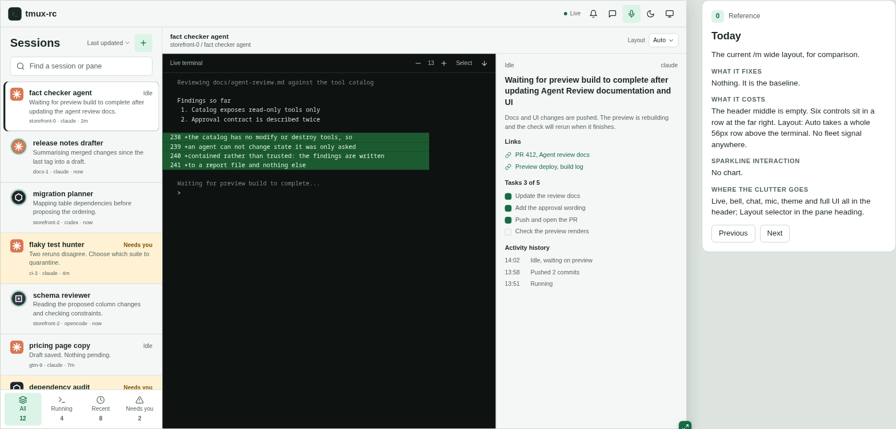

## The method

Layout is hard to argue about in prose and expensive to argue about in code: building
even one option touches the list, the header and the breakpoints, and by the time it is
reviewable it has momentum. So the options were built as **throwaway HTML mocks**, with a
few rules that made them worth trusting:

- **Real design tokens, realistic data.** Every frame uses the app's own colours and
  spacing, and a fleet that looks like a real one: dozens of panes across several tmux
  sessions, most idle, a few waiting on the user, and weeks of history with gaps where
  the laptop slept. Round 1 used real aggregate counts; later rounds use a generated
  45-pane fleet with 37 days of history, because a 7-day average over a 30-day range needs
  that much. A layout that only works with five tidy rows is not a layout.
- **Every option written up the same way.** Each frame carries four notes: what it fixes,
  what it costs, how the chart behaves, and where the displaced clutter goes. Moving six
  icons is easy; deciding where they land is the design.
- **Side by side, then one at a time.** A gallery and a comparison table show every
  option at once; a focus view opens one frame next to its notes.
- **Resizable device frames.** The focus view has device presets and a drag handle, and
  frames reflow at the app's real breakpoints, so "fine at 1440, broken at 1100" shows up
  before anyone writes the feature.
- **The user picks and riffs.** Each round ended with the user choosing, combining and
  saying what was wrong, and the next round was built from that.

The alternative, prototyping in the app on a component framework, was weighed separately
for chat (see [Should Chat adopt assistant-ui?](chat-ui-framework.md)). A framework can
speed up building one chosen design; it does not help choose between eleven.

## Round 1: where could a fleet chart live?

Eleven wide options and five phone ones. **A**, **K**, **F** and **G** put the chart in
the header (with chips, tabs, a command bar or a dock of agent logos); **B** and **H** add
a strip under it; **C**, **E** and **D** use the list column, the right panel or an
IDE-style status bar; **I** adds an icon rail so the whole header is free for the chart.

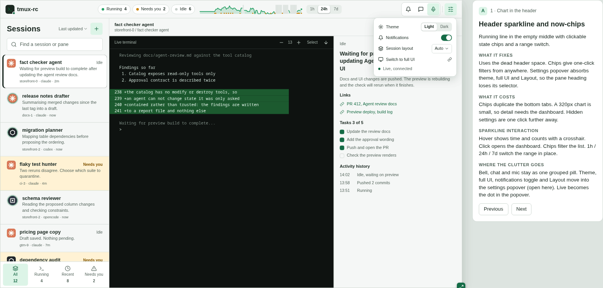

The header options were cheap but small: a 320px chart is texture, not information. **H**
was liked for one specific behaviour, a slim strip that expands in place into a full chart
with axes, without navigating away.

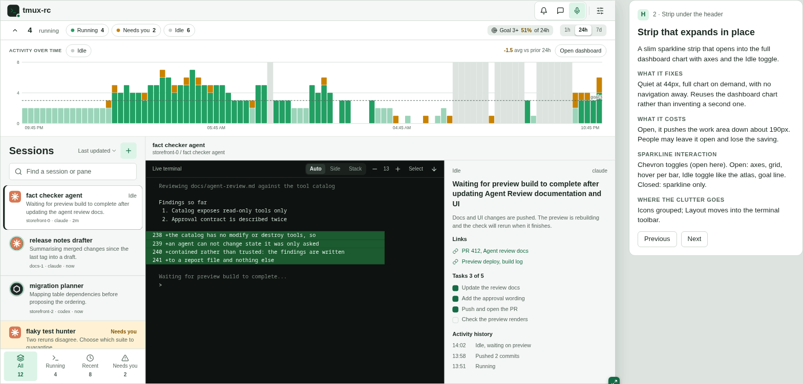

**I** won the round: separating *where you go* (the rail) from *how things are* (the
header) was the right split. But the user disliked what it did next to the Sessions
column: two navigation bars side by side. The model they pointed at was a chatbot's
thread sidebar, one column holding both destinations and conversations. They also asked
for an editable goal and a 1-day, 3-day or 7-day moving average over the bars.

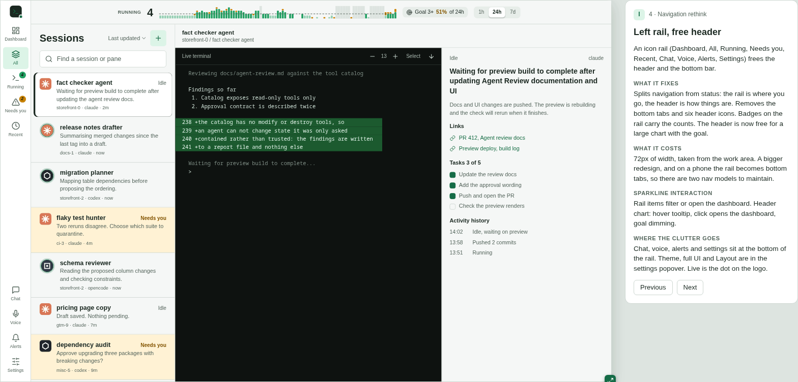

## Round 2: one sidebar

Round 2 merged rail and list into a single chatbot-style sidebar and tried the chart in
four places. **I2** kept it in the header; **I3** docked it along the bottom of the work
area, folding to a 40px strip and opening into H's expanded chart; **I4** put it in the
sidebar footer; **I5** reorganised the sidebar itself into an inbox: the panes that need
you as cards with their question text, then Working, Just finished, and a folded Idle
pile.

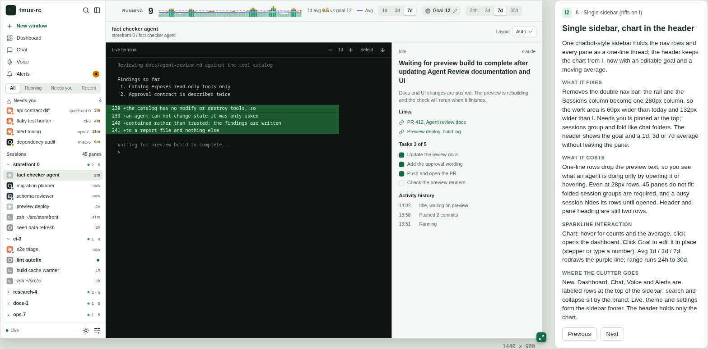

I2 still spent a full header row. I3 gave the terminal that row back and gave the chart
the widest canvas on offer, at the cost of terminal height when open.

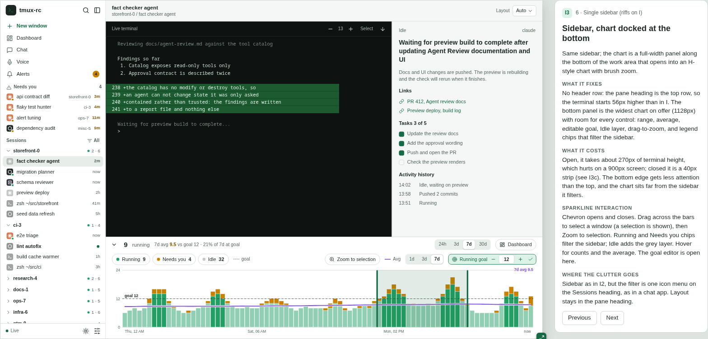

I5 was the surprise. Seeing the four questions without opening any pane changed what the
sidebar is for: it stopped being a directory and became a to-do list. The user picked
**I3 combined with I5's inbox**.

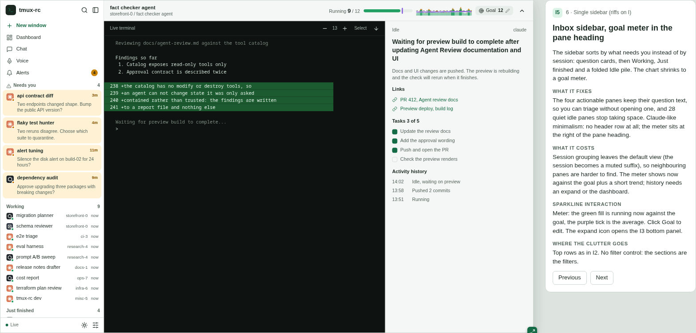

## Round 3: the hybrid, and six ways to open a chart

With the sidebar settled, round 3 held it fixed and varied two things. In the sidebar:
per-group density (one-line rows or activity cards), group by state or by tmux session,
and reply buttons on the question cards so an answer takes one click. For the chart: six
ways to open it, in place (**R3a**), as an overlay drawer (**R3b**), as a resizable split
with snap points (**R3c**), as a full dashboard page (**R3d**), as a hover peek (**R3e**), or
spread across the group headers as per-session sparklines (**R3f**).

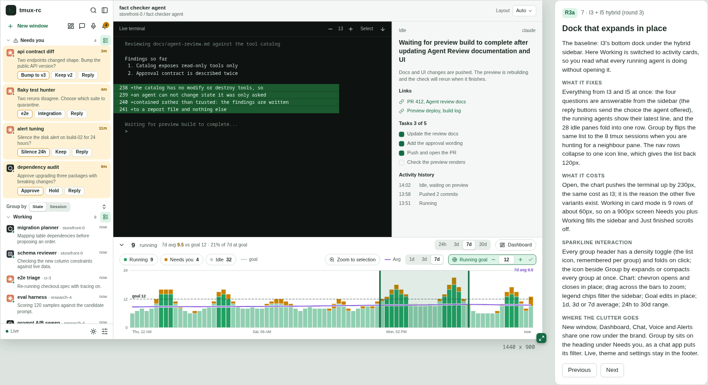

The user picked the sidebar with inline replies (R3a and R3c), the **R3c** split, where
the terminal-to-chart trade is chosen once and stays, and the **R3d** dashboard page,
whose per-session small multiples show which session is carrying the count. The drawer
and the peek are transient, which is a poor fit for a number you want in view while you
work.

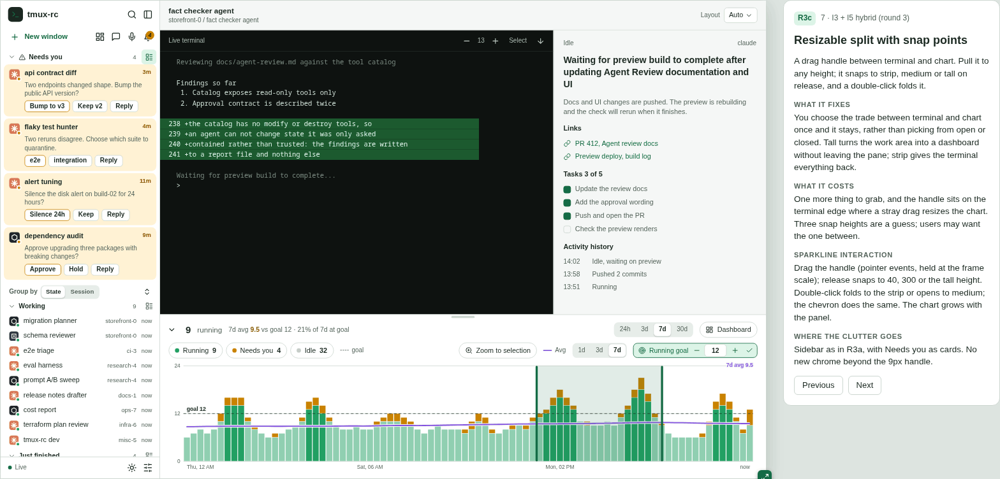

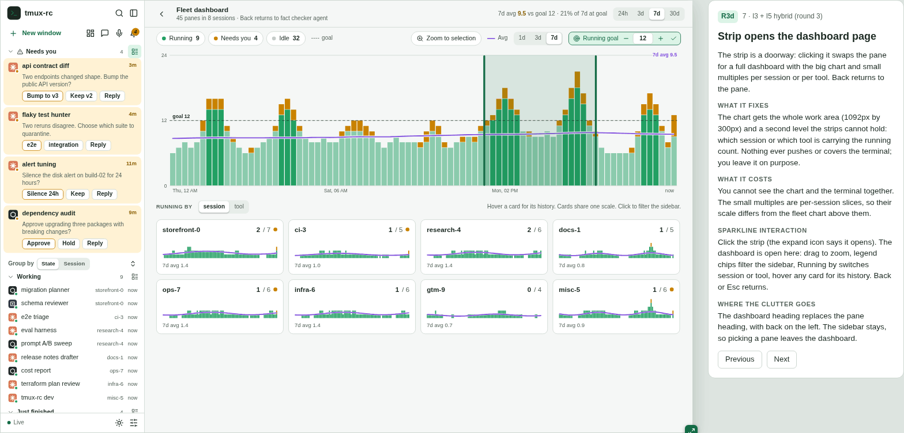

The phone frames (**P8**, **P9**) brought the same sidebar to a 390px screen. They were
rejected outright: putting the desktop UI on a phone makes no sense. The phone keeps its
own layout.

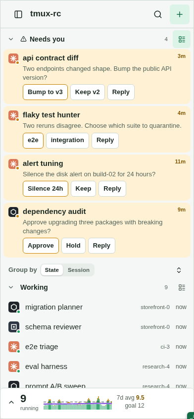

The comparison table summarises every option in the file, newest round first:

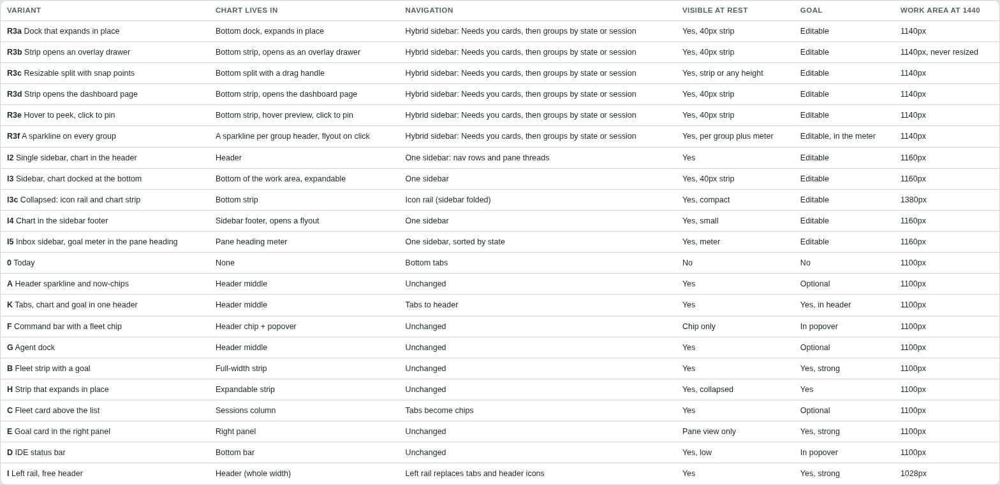

## What was built, and what changed on contact

The choices became three pull requests:
[#298](https://github.com/querystory/tmux-rc/pull/298) (the hybrid sidebar with answerable
Needs you cards, grouped by state or session),
[#299](https://github.com/querystory/tmux-rc/pull/299) (the chart as a split under the
pane, the dashboard page, a shared goal and moving average) and
[#301](https://github.com/querystory/tmux-rc/pull/301) (chat docked beside the work area
instead of a modal sheet).

Using the built thing surfaced what the mocks could not:

- **Idle is not folded by default**, unlike the mock.
- **Rows get rich hover cards.** One-line rows lose the preview text; hovering brings it
  back without reintroducing the clutter.
- **Legend chips filter the chart only.** In the mock they also filtered the sidebar, so
  exploring the chart reshuffled the list; now the two are independent.
- **The chart header is one line**, with Set goal next to the running count rather than a
  second toolbar row.
- **The moving average defaults to 1 day**, and wide screens default to a 7-day range, so
  the line follows the days within the week rather than flattening across it.

Screenshots of the shipped result belong here once the fixture-based screenshot tooling
lands, so they show the same synthetic fleet as the mocks rather than someone's real panes.

## Next time

The mock is a single HTML file with no build step and no network fetches. To iterate on
it, open it from the docs site or the repo, copy a variant entry in its variant list,
give it a new id and group, fill in the four notes, and arrange the existing pieces
(sidebar, dock, chart, detail pane) in its builder. Start a new round as a new group
rather than editing the old frames: the earlier rounds are the record of why the current
design looks the way it does.

Two habits are worth keeping. Use realistic synthetic data, ideally the fixture
tooling's, so mock and shipped screenshots show the same fleet. And drag every frame down
to tablet and phone widths before showing it: the breakpoints are where layouts fail.
