| shot | changed vs `origin/main` |
| --- | --- |
| hero | 1.16% |
| mobile-list-dark | 0.00% |
| mobile-list | 0.00% |
| mobile-menu | 0.00% |
| mobile-needs-you | 0.23% |
| mobile-pane | 0.00% |
| mobile-terminal | 0.00% |
| wide-chat | 0.89% |
| wide-dashboard-dark | 0.74% |
| wide-dashboard | 0.78% |
| wide-needs-you | 0.91% |
| wide-pane-dark | 2.49% |
| wide-subagents | 3.52% |

| changed | base | head | diff |
| --- | --- | --- | --- |
| hero | 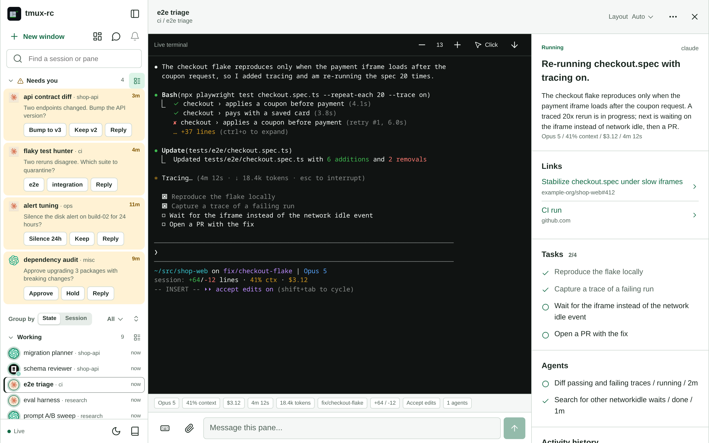 |  | 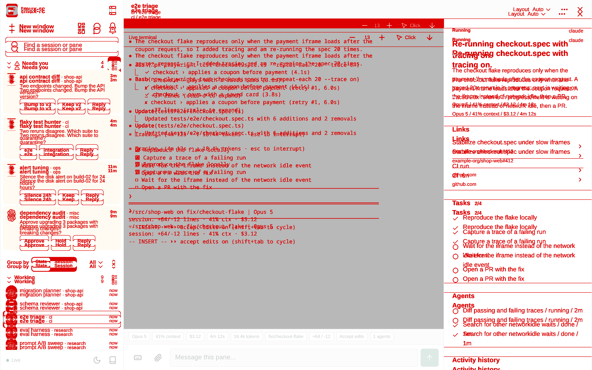 |
| mobile-needs-you |  |  |  |
| wide-chat | 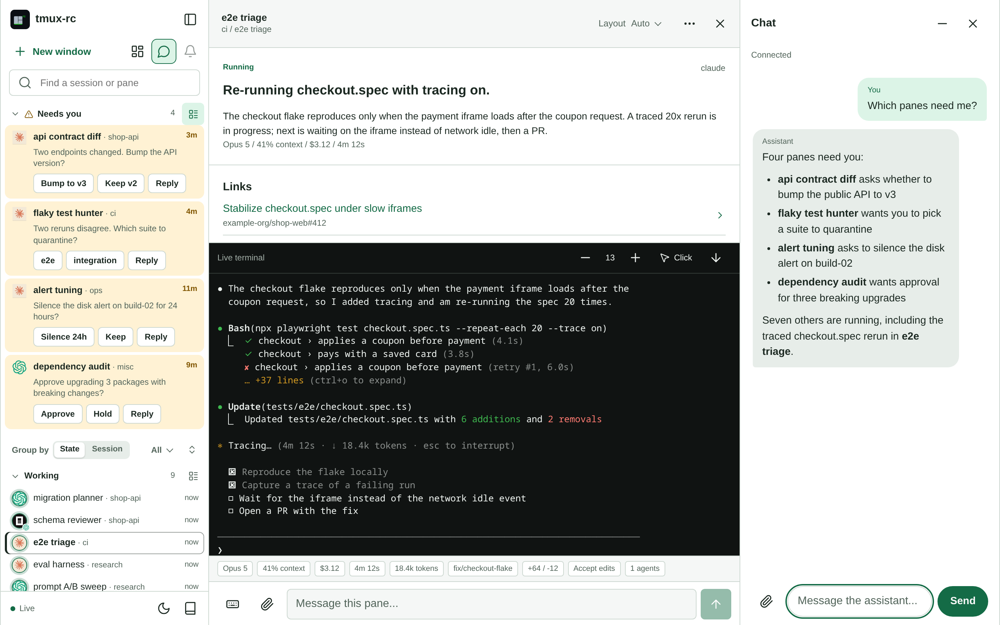 |  | 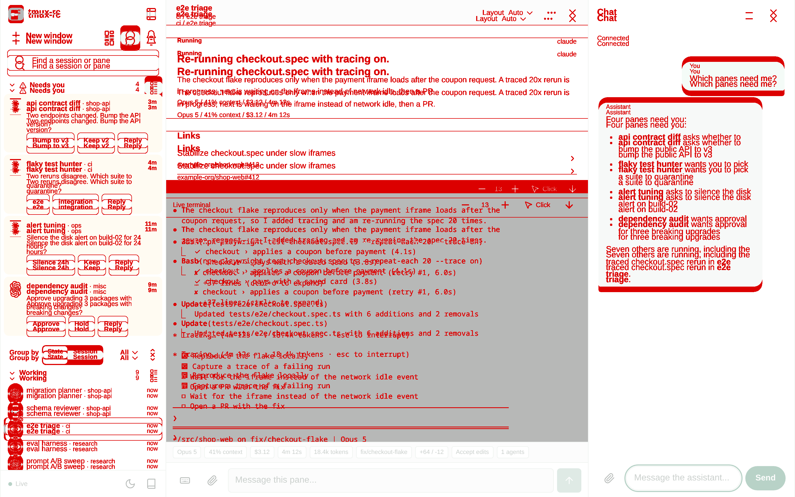 |
| wide-dashboard-dark | 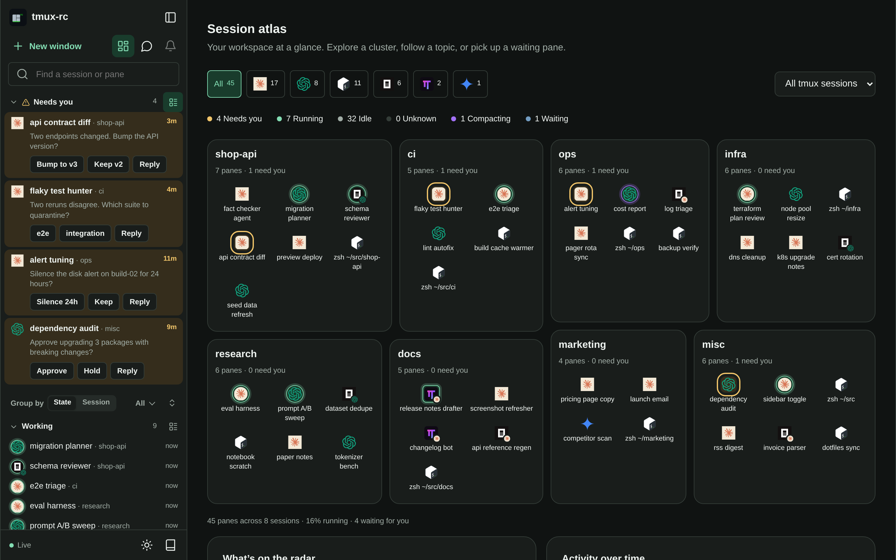 | 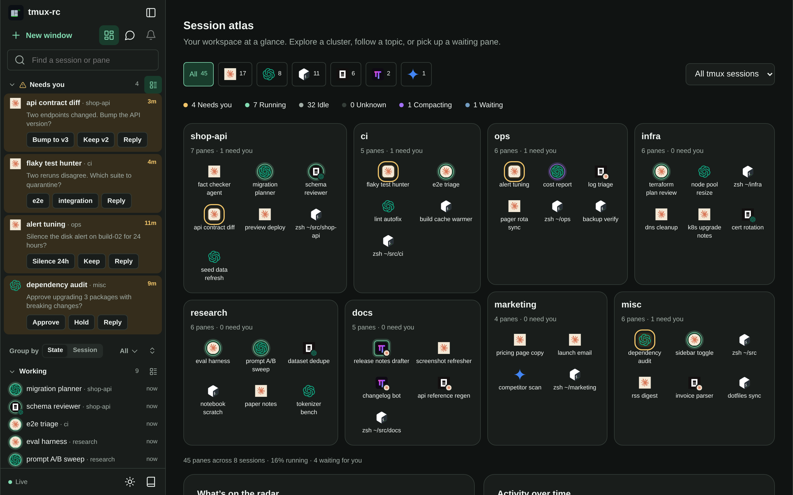 | 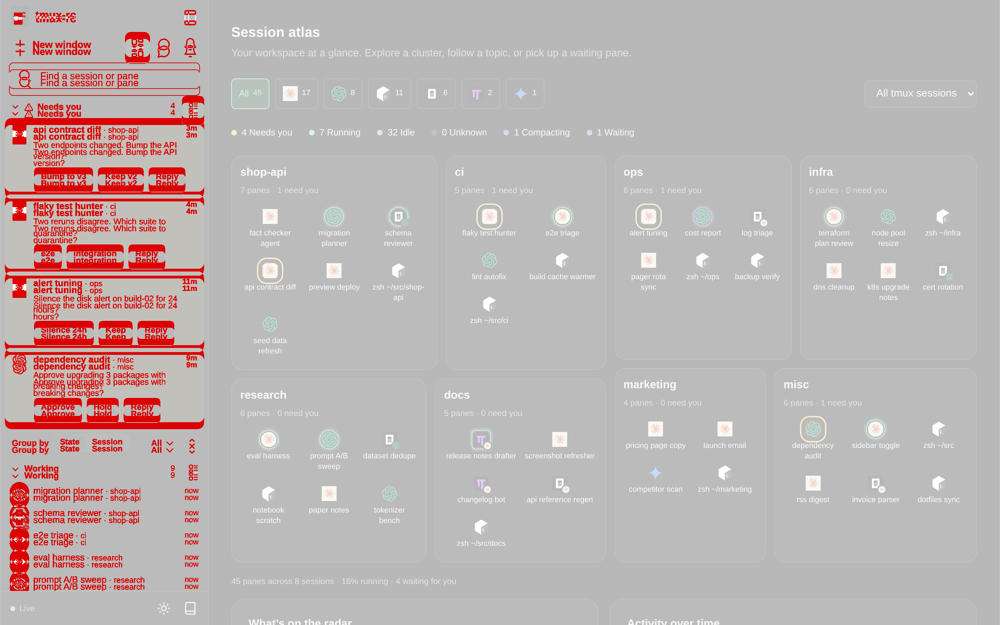 |
| wide-dashboard | 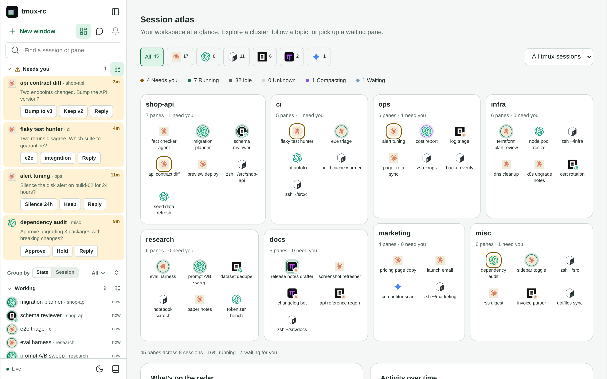 | 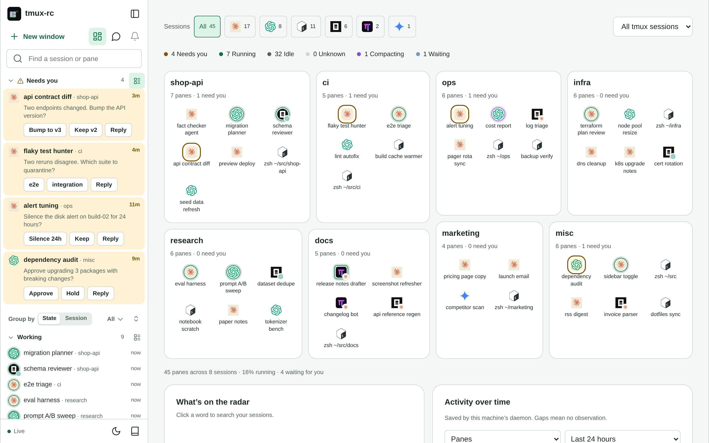 | 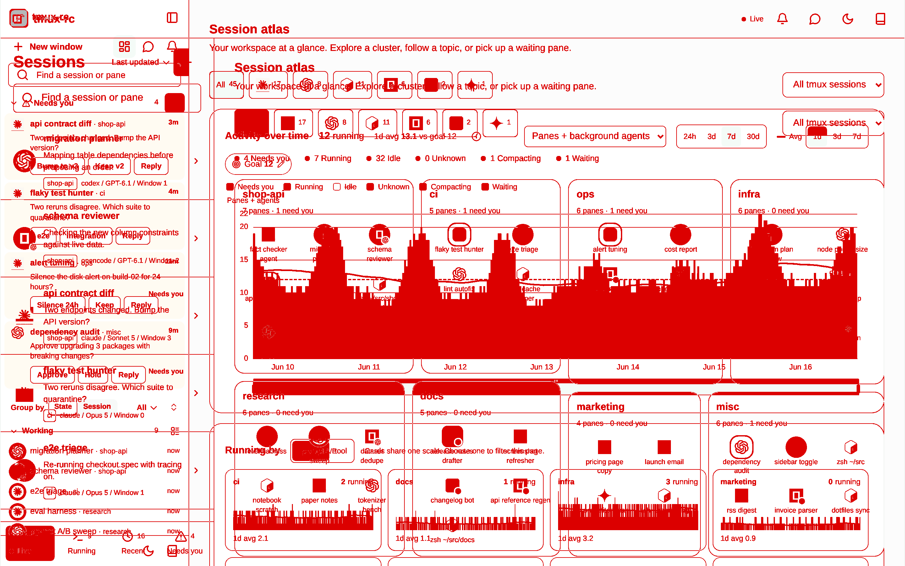 |
| wide-needs-you | 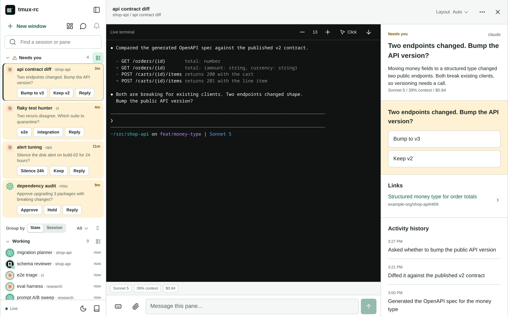 | 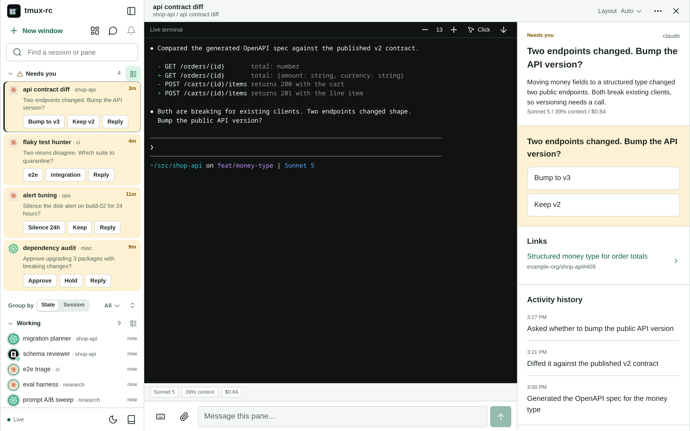 | 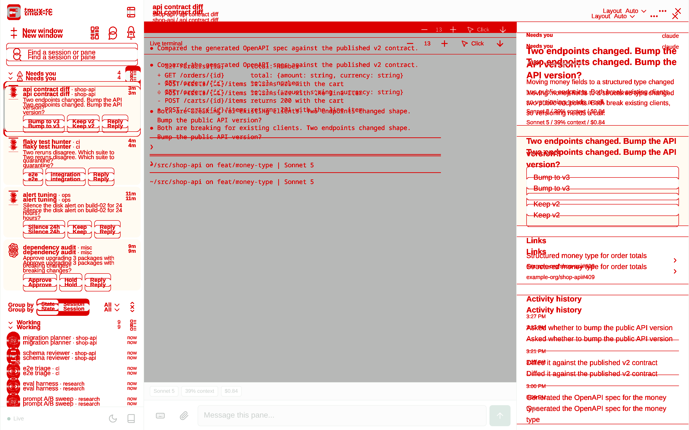 |
| wide-pane-dark | 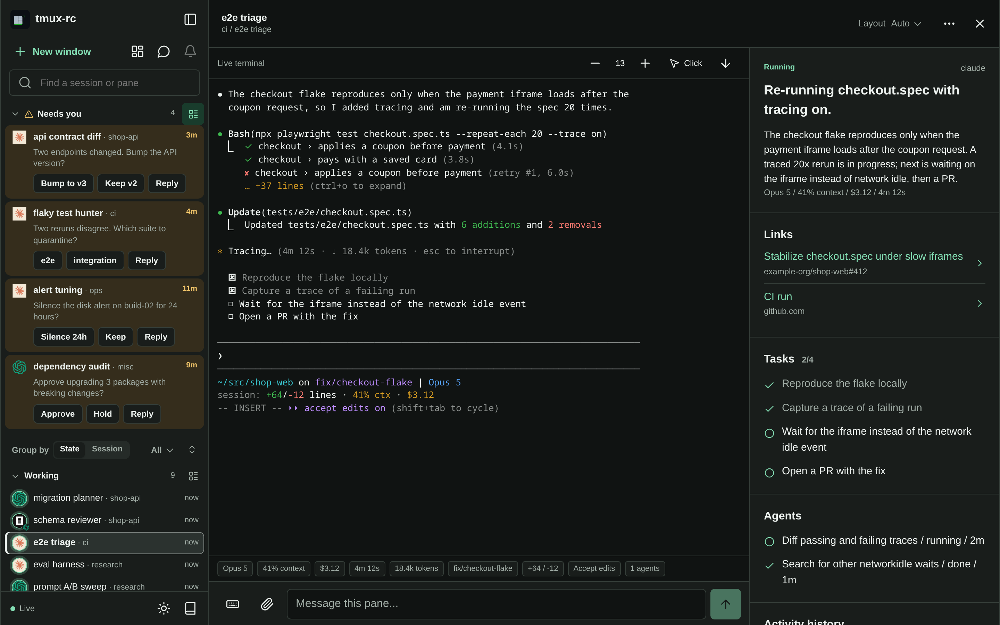 | 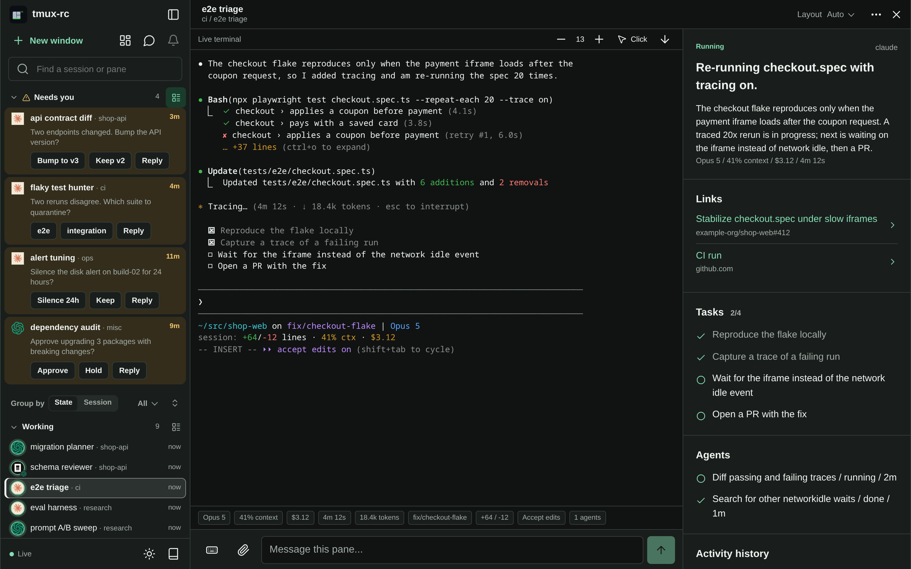 | 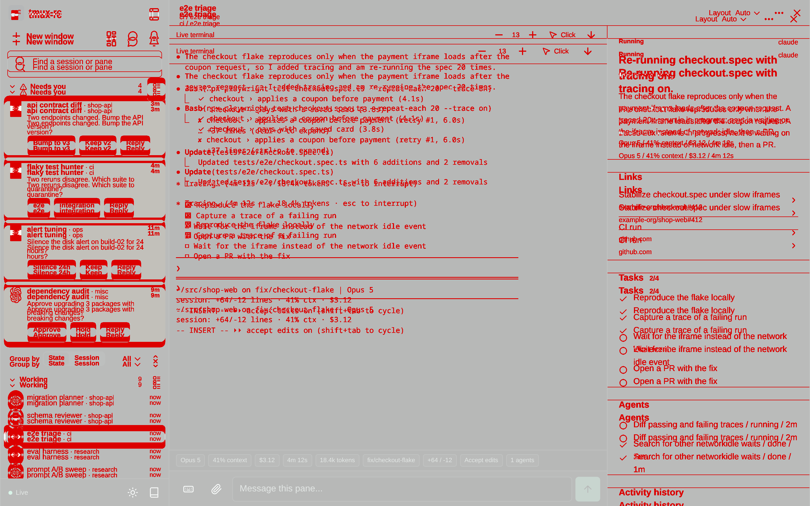 |
| wide-subagents |  |  |  |
